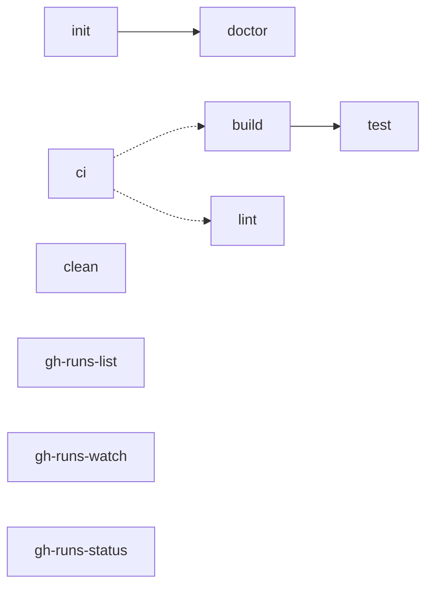

# Makefile Reference

The [`Makefile`](./Makefile) is the single source of truth for orchestrating
{{SCOPE_DESCRIPTION}}. Run `make help` for the quick target list; this file is
the narrative reference.

## Target overview

Solid arrows = hard prerequisite. Dotted arrows = pass-through / independent gates.

## Targets

### Develop

| Target | Description |
|--------|-------------|
| `help` | List targets (default goal) |
| `init` | {{INIT_TABLE_DESC}} |
| `doctor` | Tool/environment check via `triage`; `MODE=default\|release` |
| `build` | {{BUILD_TABLE_DESC}} |
| `lint` | {{LINT_TABLE_DESC}} |
| `format` | {{FORMAT_TABLE_DESC}} |
| `test` | {{TEST_TABLE_DESC}} |
| `ci` | Full pre-push gate — what CI runs |
| `pre-commit` | Alias of `ci` |
| `clean` | {{CLEAN_TABLE_DESC}} |

### GitHub

| Target | Description |
|--------|-------------|
| `gh-runs-list` | In-flight Actions runs (`status != completed`) |
| `gh-runs-watch` | Watch active runs to completion |
| `gh-runs-status` | Last completed run per workflow; skipped/neutral are not failures |

### Release / Danger

Document release and deploy targets here when present.

## `make init`

Describe idempotent bootstrap behavior and any repos or stacks skipped at the
workspace level.

## `make doctor`

Requires `triage` (`brew install lolay/tap/triage`). Document profiles and pin
files checked.

## CI alignment

Map GitHub Actions workflows to `make` targets so a green local `make ci` matches
CI.
