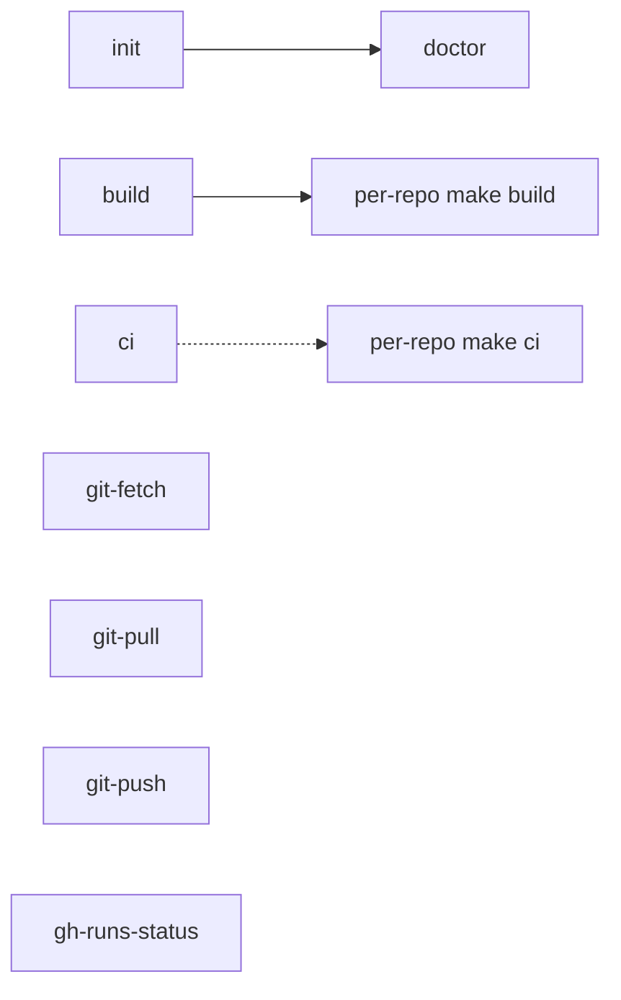

# Makefile Reference

The [`Makefile`](./Makefile) orchestrates the {{ESTATE_NAME}} multi-repo estate.
It reads [`repos.mk`](./repos.mk) as its manifest. Run `make help` for the quick
target list.

The workspace is optional. Every child repo is fully usable on its own.

## Target overview

## Workspace targets

### Develop

| Target | Description |
|--------|-------------|
| `help` | List targets |
| `init` | Clone missing repos, per-repo `make init`, then `doctor` |
| `doctor` | Repo roster + triage delegate tree (or per-repo doctor fallback) |
| `build` | Fan-out in `REPOS_BUILD_ORDER` |
| `ci`, `pre-commit` | Pass-through to `REPOS_MAKE_CI`; collect all failures |
| `clean` | Fan-out to `REPOS_MAKE_CLEAN` |

### Git

| Target | Description |
|--------|-------------|
| `git-status`, `git-fetch`, `git-pull`, `git-push` | Cross-repo git convenience |

### GitHub

| Target | Description |
|--------|-------------|
| `gh-runs-list`, `gh-runs-watch`, `gh-runs-status` | Delegate to each repo in `REPOS_GH` |

## repos.mk

Document list variables and which repos participate in each target. Keep
consistent when adding or removing repos.

## Worktree convention

Document sibling worktree naming if the estate uses git worktrees.
