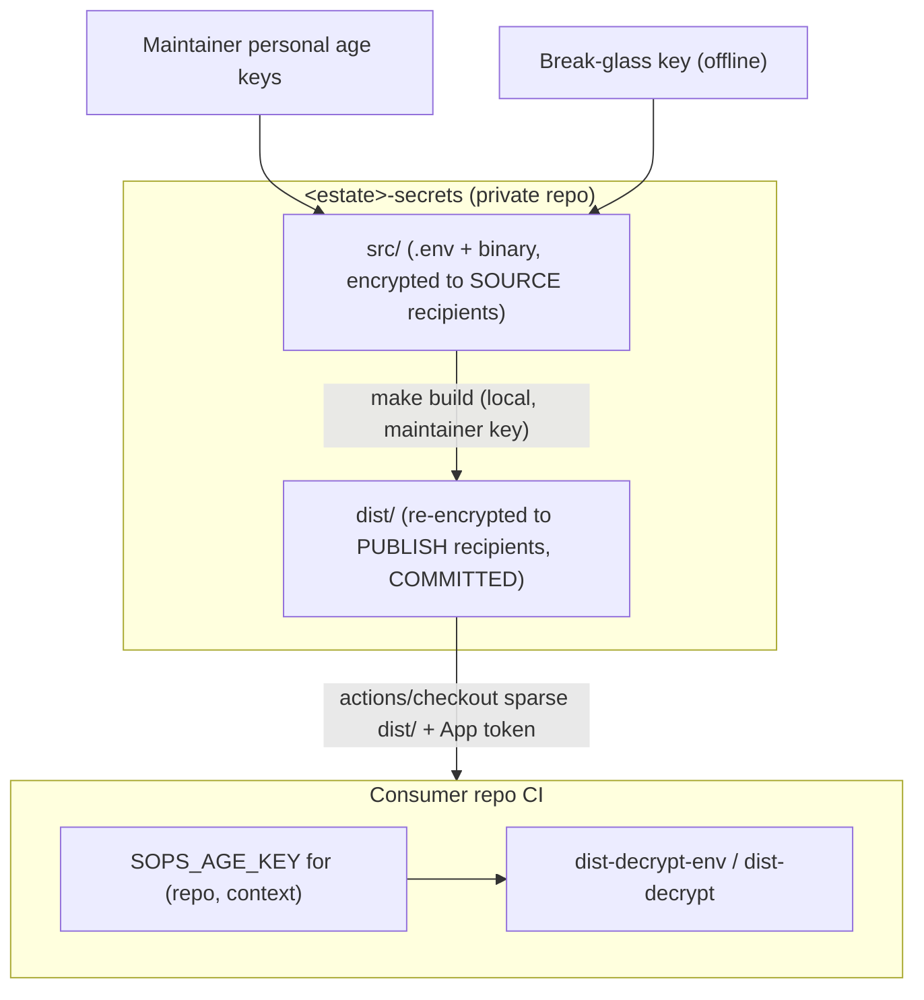

# Secrets Repository — Reference Architecture

> **Status:** candidate reference architecture / personal standard. Not a universal
> default — see [README.md](README.md) for when to adopt and known tradeoffs.
>
> Placeholders: `<estate>` (e.g. `example`), `<org>` (e.g. `lolay`).

Candidate architecture for managing secrets across an estate through a single
private GitHub repo, using SOPS + age. Portable across projects: it needs nothing
but GitHub (no cloud KMS, no 1Password, no external secret store).

## Goals

- One source of truth for all secrets in an estate, version-controlled (as ciphertext).
- Coarse access control by **file** (topic), fine access control by **key**.
- Access granted by named **groups** of `repo__context` identities, mapped to
  files explicitly — no inherited or implied access. See
  [Groups and the access matrix](#groups-and-the-access-matrix).
- Per-consumer, per-context keys so a leak is contained.
- No always-on machine key that can read the editable source secrets.
- Cloud-agnostic: GitHub + age only.

## How it works in one picture



Two independent gates protect a consumer:

1. **Coarse / can you fetch the ciphertext at all** — a read-only **Secrets
   GitHub App** grants `contents: read` on the secrets repo so CI can check it
   out. This is per-repo.
2. **Fine / what can you actually decrypt** — the consumer's `SOPS_AGE_KEY`.
   A consumer may pull every file but only decrypts the ones encrypted to its
   key. All access control lives here.

The key never decrypts more than it is a recipient of, so the second gate is the
real access-control boundary; the App is just "are you allowed to see the
(encrypted) blobs."

---

## Consumer side (start here)

This is what every consuming repo wires up. Makefile target details and examples:
[makefile.md](makefile.md).

### Identity model: `(repo, context)`

Each consumer gets its own age keypair **per execution context**, because
GitHub keeps separate secret stores that can each hold a secret of the **same
name** with a **different value**:

- `actions` — normal CI
- `agents` — GitHub Agents / Copilot coding-agent runs (separate store from Actions)
- `codespaces`
- `dependabot`

The secret is **always named `SOPS_AGE_KEY`**; only the value differs per store.
This is how you give an agent *less* than actions: the `agents` key is a
recipient of fewer files than the `actions` key in the same repo.

> Provisioning note: `gh secret set SOPS_AGE_KEY --app actions|agents|codespaces|dependabot`
> covers the four native stores. `dependabot` cannot mint App tokens the normal
> way, so a Dependabot job that needs secrets must have them pre-staged rather
> than fetched live.

The identity is always `(repo, context)`. Provision the `actions` context for a
repo first; add `agents` / `codespaces` / `dependabot` for that repo when a
workflow in that context needs secrets. Each context key is one more recipient on
the files it can open.

### The consumer step

The consumer checks out `dist/` (HEAD is always the latest) and decrypts what its
key can open. Prefer the [least-privilege hierarchy](makefile.md#least-privilege-hierarchy).

**Checkout (all consumers):**

```yaml
- uses: actions/create-github-app-token@v1
  id: tok
  with:
    app-id: ${{ vars.SECRETS_APP_ID }}
    private-key: ${{ secrets.SECRETS_APP_PRIVATE_KEY }}
    owner: <org>
    repositories: <estate>-secrets
    permission-contents: read

- uses: actions/checkout@v4
  with:
    repository: <org>/<estate>-secrets
    token: ${{ steps.tok.outputs.token }}
    sparse-checkout: dist
    path: _secrets
    fetch-depth: 1

- uses: nhedger/setup-sops@v2   # installs the sops binary; age support is built in
```

**Decrypt (pick the narrowest target):**

```yaml
# 1. One key, one command (preferred when a single value suffices)
- name: Use required secret for one command only
  env:
    SOPS_AGE_KEY: ${{ secrets.SOPS_AGE_KEY }}
  run: PUBLIC_API_URL="$(make -C _secrets dist-decrypt-env KEY=PUBLIC_API_URL)" npm run build

# 2a. Export one key to the job environment for later steps
- name: Export one required secret for later steps
  env:
    SOPS_AGE_KEY: ${{ secrets.SOPS_AGE_KEY }}
  run: make -C _secrets dist-decrypt-env KEY=PUBLIC_API_URL FORMAT=dotenv >> "$GITHUB_ENV"

# 2b. Export all decryptable env secrets for later steps
- name: Export all decryptable env secrets for later steps
  env:
    SOPS_AGE_KEY: ${{ secrets.SOPS_AGE_KEY }}
  run: make -C _secrets dist-decrypt-env >> "$GITHUB_ENV"

# 3. Decrypt a binary/file secret to disk (signing material, certs)
- name: Decrypt signing file to disk
  env:
    SOPS_AGE_KEY: ${{ secrets.SOPS_AGE_KEY }}
  run: make -C _secrets dist-decrypt FILE=ios/AuthKey_BV7QPDLS45.p8
```

Notes:

- **One shipped entrypoint.** `dist-decrypt-env.sh` and `dist-decrypt.sh` live in
  the secrets repo and travel with the checkout, so decrypt logic is defined once.
- **Always latest, no versioning needed.** `actions/checkout` at HEAD of `main`
  gives the newest `dist/`. Pin `ref:` to a SHA or tag only for reproducible builds.
- **What the checkout pulls.** Cone-mode `sparse-checkout: dist` brings `dist/`
  plus root files (`Makefile`, `dist-decrypt-env.sh`, `dist-decrypt.sh`) — never
  `src/`, `scripts/`, or `keys/`.
- The same step works for Codespaces and GitHub Agents; only the *store* the
  `SOPS_AGE_KEY` is read from changes.
- **`dist-decrypt-env`** emits dotenv to stdout only — never writes env files to
  disk. **`dist-decrypt`** writes plaintext siblings to disk only — never emits
  environment assignments.
- Workflow jobs should decrypt only the file(s) or key(s) needed; separate
  sensitive topics into different env files and contexts where practical.

---

## The secrets repo

### Structure

```text
<estate>-secrets/                       private repo
├─ .sops.yaml                              SOURCE recipients (maintainer + break-glass pubs) for src/ and keys/
├─ .gitignore                              track only *.sops under src/ dist/ keys/ (plaintext can't be committed)
├─ Makefile                                see makefile.md
├─ README.md                               short pointer to this spec
├─ access.map                              SOURCE OF TRUTH: groups + file -> groups/identities (logical names, no .sops)
├─ breakglass.pub                          break-glass PUBLIC key (a publish recipient on every file)
├─ dist-decrypt-env.sh                     CONSUMER entrypoint: dotenv to stdout
├─ dist-decrypt.sh                         CONSUMER entrypoint: files to disk
├─ src/                                    editable originals; only *.sops is tracked (plaintext sibling is gitignored)
│  ├─ oss.env.sops                         .env topics (dotenv)
│  ├─ commercial.env.sops
│  ├─ payments.env.sops
│  └─ ios/                                 binary blobs (certs, keys); any folder depth is allowed
│     ├─ AuthKey_BV7QPDLS45.p8.sops
│     └─ distribution.p12.sops
├─ dist/                                   COMMITTED, re-encrypted per-file to PUBLISH recipients (mirrors src/)
│  ├─ oss.env.sops
│  ├─ commercial.env.sops
│  ├─ payments.env.sops
│  └─ ios/
│     ├─ AuthKey_BV7QPDLS45.p8.sops
│     └─ distribution.p12.sops
├─ keys/
│  └─ repos.env.sops                       SOPS-enc to maintainers + break-glass:
│                                          <repo>__<context>__public / __private for every consumer
├─ scripts/
│  ├─ lib.sh                               shared helpers (access.map parsing, registry I/O)
│  ├─ build.sh                             resolve publish recipients (transient) + re-encrypt src/ -> dist/
│  ├─ crypt.sh                             src <-> .sops sibling (safe + idempotent)
│  ├─ keys.sh                              mint (refuses to overwrite) / rotate / retire consumer keypairs
│  ├─ set-consumer-keys.sh                 fan SOPS_AGE_KEY out to all (or one) repo__context
│  ├─ check.sh                             keyless checks for the hook and CI
│  └─ verify.sh                            grants, denials, and freshness with every consumer key
├─ .githooks/
│  └─ pre-commit                           keyless: refuse non-.sops + assert src/<f>.sops paired with dist/<f>.sops
└─ .github/workflows/
   └─ freshness.yml                        keyless CI: the same checks over the pushed range
```

**The `.sops` convention.** Every encrypted file on disk carries a trailing
`.sops` suffix (`oss.env.sops`, `ios/AuthKey_BV7QPDLS45.p8.sops`). A decrypted
file is the same name **without** the suffix, written right next to its
ciphertext (`oss.env` beside `oss.env.sops`). `.gitignore` tracks only `*.sops`
under `src/`, `dist/`, and `keys/`, so a decrypted plaintext sibling literally
cannot be committed — the suffix is the safety boundary, not just a hook. The
`access.map` and the matrix below use the **logical** name (no `.sops`); the
scripts add/strip the suffix.

The tracked secrets-bearing files are exactly `.sops.yaml`, `access.map`,
`breakglass.pub`, and the `*.sops` files under `src/`, `dist/`, and `keys/`;
the rest is tooling (`Makefile`, `scripts/`, the consumer entrypoints, the
hook, and the keyless workflow). **Publish recipient lists are never
committed** — `build` computes them transiently from `access.map` +
`keys/repos.env.sops` at encrypt time. There is intentionally **no
workflow that holds a key**; the kit's `freshness.yml` is keyless.

```gitignore
# .gitignore — only *.sops is tracked under src/ dist/ keys/; plaintext siblings are ignored
/src/**
/dist/**
/keys/**
!/src/**/
!/dist/**/
!/keys/**/
!/src/**/*.sops
!/dist/**/*.sops
!/keys/**/*.sops
```

### Groups and the access matrix

Files are the coarse access unit. Name them by topic, and grant access with named
**groups** of `repo__context` identities. A group is just a label for a set of
identities — there is **no inheritance or implied access**. Every file lists
exactly the groups (or individual `repo__context` keys) allowed to decrypt it.

Worked example estate (cells are `repo__context`; the `actions` context is shown —
a repo may also have `agents`, `codespaces`, etc.):

| file \ identity (group)  | example (oss) | example-site (oss) | example-app (commercial) | example-infra (commercial) | example-api (payments) |
|--------------------------|:---:|:---:|:---:|:---:|:---:|
| `oss.env`                | yes | yes | yes | yes | yes |
| `commercial.env`         |     |     | yes | yes | yes |
| `payments.env`           |     |     |     |     | yes |
| `ios/AuthKey_*.p8`       |     |     | yes |     |     |
| `ios/distribution.p12`   |     |     | yes |     |     |

Each row is exactly the access list for that file — nothing is inferred:

- `oss.env` lists `@oss`, `@commercial`, and `@payments`, so every identity reads
  it (you list those groups; it is not automatic).
- `commercial.env` lists `@commercial` and `@payments`, not `@oss`.
- `payments.env` lists only `@payments` — a single repo here (`example-api`).
- The iOS signing assets list only `example-app__actions` — narrower than any
  group. Note `@payments`, despite being the most sensitive group, has **no**
  access to them: because groups do not inherit, "most sensitive" never implies
  "reads everything."

> Multi-project repos: if one `<estate>-secrets` repo serves several projects,
> prefix files with the project — `web-oss.env`, `mobile-commercial.env` — so the
> topic stays the access unit while names stay unambiguous.

### Two keyrings

- **SOURCE recipients** = maintainer personal keys + break-glass. This list **is
  committed** — it lives in `.sops.yaml`. Only these keys can read `src/` (and
  `keys/repos.env.sops`). Re-encryption to `dist/` happens **locally** with a
  maintainer key, so no machine key ever reads source.
- **PUBLISH recipients** (per file) = the consumer `(repo, context)` keys allowed
  to decrypt that file, plus break-glass. `build` resolves them from `access.map`
  + `keys/repos.env.sops` at encrypt time; the lists are transient and never
  committed. They cannot open `src/`.

```yaml
# .sops.yaml — committed SOURCE recipients (maintainers + break-glass)
creation_rules:
  - path_regex: ^(src|keys)/.*
    age: >-
      age1alice...,
      age1bob...,
      age1breakglass...      # same key as breakglass.pub
```

Adding/removing a maintainer: edit the `age:` list in `.sops.yaml`, then
`sops updatekeys src/**/*.sops keys/repos.env.sops` to re-encrypt source to the
new set.

### `access.map` — the source of truth

Define groups as sets of `repo__context` identities at the top, then list which
groups (or individual `repo__context` keys) may decrypt each file. There is no
inheritance — list every group that should have access.

```text
# --- groups: named sets of repo__context identities ---
@oss        = example__actions example-site__actions
@commercial = example-app__actions example-infra__actions
@payments   = example-api__actions

# --- file : groups / identities allowed to DECRYPT it (no inheritance) ---
oss.env:                    @oss @commercial @payments
commercial.env:             @commercial @payments
payments.env:               @payments

ios/AuthKey_BV7QPDLS45.p8:  example-app__actions
ios/distribution.p12:       example-app__actions
```

At build time `build.sh` expands each `@group`, resolves public keys from
`keys/repos.env.sops`, adds break-glass, and re-encrypts `src/<file>.sops` to
`dist/<file>.sops`.

### `keys/repos.env.sops` — the consumer key registry

One SOPS-encrypted dotenv (recipients: maintainers + break-glass) holding every
consumer keypair:

```dotenv
example-app__actions__public=age1...
example-app__actions__private=AGE-SECRET-KEY-1...
example-app__agents__public=age1...
example-app__agents__private=AGE-SECRET-KEY-1...
example-api__actions__public=age1...
example-api__actions__private=AGE-SECRET-KEY-1...
```

> Delimiter: use `__` — `<repo>__<context>__public` / `__private` — so repo
> names with dashes parse unambiguously.

This file is decrypted **only** by maintainer-local targets (`make build`,
`make set-keys`). **Custody caveat:** it holds every consumer *private* key in one
place. A maintainer source-key compromise exposes all consumer contexts — plan
break-glass and maintainer access accordingly.

### Non-`.env` secrets (binary: `.p8`, `.p12`, certs, mobileprovision)

Binary blobs use SOPS **binary** type — same repo, recipients, and access matrix:

```bash
cp /path/to/AuthKey_BV7QPDLS45.p8 src/ios/AuthKey_BV7QPDLS45.p8
make src-encrypt FILE=ios/AuthKey_BV7QPDLS45.p8
make build
```

On the consumer, `make dist-decrypt FILE=ios/AuthKey_BV7QPDLS45.p8` writes the
plaintext next to its `.sops` file (`_secrets/dist/ios/AuthKey_BV7QPDLS45.p8`).

```yaml
- name: Use iOS signing secrets
  env:
    SOPS_AGE_KEY: ${{ secrets.SOPS_AGE_KEY }}
  run: |
    set -euo pipefail
    make -C _secrets dist-decrypt FILE=ios/AuthKey_BV7QPDLS45.p8
    make -C _secrets dist-decrypt FILE=ios/distribution.p12
    mkdir -p ~/private_keys
    cp _secrets/dist/ios/AuthKey_BV7QPDLS45.p8 ~/private_keys/
    security import _secrets/dist/ios/distribution.p12 -k <keychain> ...
```

> Size note: SOPS binary base64-inflates ~33%; fine for keys/certs (KB range).
> Scope signing material to one repo.

---

## Makefile

Full target contract, arguments, and GitHub Actions examples: [makefile.md](makefile.md).

**What runs where:** targets that read source secrets (`src-decrypt`, `src-encrypt`,
`build`, `set-keys`, `mint`, `rotate`) are maintainer-local and need a source key.
`dist-decrypt-env` and `dist-decrypt` run on consumers and need only that
consumer's `SOPS_AGE_KEY`. Nothing requires a source key in CI.

---

## Reference implementation

The scripts live as a tested kit in the `personal-secrets` skill:
[`templates/secrets-repo/`](../../../personal-secrets/templates/secrets-repo/),
with an end-to-end test in
[`tests/test-kit.sh`](../../../personal-secrets/tests/test-kit.sh). Copy the
kit to start a new secrets repo.

| File | Role |
| --- | --- |
| `dist-decrypt-env.sh` | Consumer: dotenv secrets to stdout, never to disk |
| `dist-decrypt.sh` | Consumer: decrypt files to owner-only plaintext siblings; no env output |
| `scripts/build.sh` | Resolve publish recipients (transient) and re-encrypt `src/` to `dist/`; delete `dist/` files no longer mapped |
| `scripts/crypt.sh` | `src/` to and from `.sops` siblings, safe and idempotent |
| `scripts/keys.sh` | `mint`, `rotate`, `retire` consumer keypairs in `keys/repos.env.sops`, with no plaintext registry on disk |
| `scripts/set-consumer-keys.sh` | Push `SOPS_AGE_KEY` to each `(repo, context)` store; key goes to `gh` on stdin |
| `scripts/check.sh` | Keyless checks shared by the pre-commit hook and CI |
| `scripts/verify.sh` | With each consumer key: granted identities decrypt, others don't, and `dist/` matches `src/` |

Two constraints the implementation has to respect:

- **Encrypting `dist/` must bypass `.sops.yaml`.** Its only creation rule
  covers `src/` and `keys/`, so `sops -e` on stdin fails with "no matching
  creation rules found", even with `SOPS_AGE_RECIPIENTS` or `--age` set.
  `build.sh` passes `--config /dev/null` with `--age <recipients>`, and
  writes through a temp file so a failure never leaves an empty `dist/`
  file to commit.
- **macOS ships bash 3.2**, so the scripts avoid associative arrays and
  other bash 4 features.

---

## Build & freshness

`dist/` is committed, so it must stay in sync with `src/`. Two keyless guards:

1. **Local pre-commit hook** — refuse non-`.sops` under `src/`, `dist/`, `keys/`;
   require every changed `src/<file>.sops` to ship with matching `dist/<file>.sops`,
   and an `access.map` change to ship with a rebuilt `dist/`.

2. **Keyless CI check** (`freshness.yml`) — the same rules over the pushed range.

A maintainer's `make verify` goes further: it decrypts every `dist/` file with
every consumer key, so it catches a stale `dist/` and any over-sharing that
the keyless checks can't see.

---

## Setup runbook (one-time)

1. Create private repo `<org>/<estate>-secrets`. Protect `main`; CODEOWNERS on
   `src/`, `access.map`, `keys/`, `.githooks/`.
2. Generate break-glass key offline; put public key in `breakglass.pub` and
   `.sops.yaml`.
3. Add maintainer public keys to `.sops.yaml`.
4. Register read-only Secrets GitHub App (`contents: read`); install on secrets
   repo and consumers. Distribute `SECRETS_APP_ID` + `SECRETS_APP_PRIVATE_KEY`.
5. Copy the kit, then `make init` locally.
6. `make mint REPO=<repo> CONTEXT=actions` (and `agents` etc. as needed); edit
   `access.map`.
7. Drop plaintext into `src/`, `make src-encrypt`, `make build`, commit `*.sops`.
8. `make set-keys` to push `SOPS_AGE_KEY` to each store.
9. Wire consumers with the [consumer step](#the-consumer-step).

---

## Rotation & offboarding

- **Add consumer key:** `make mint REPO=.. CONTEXT=..` (refuses if exists).
- **Rotate consumer key:** `make rotate` → `set-keys` → `build` → commit. Stops
  *future* decryption with the old key; does not erase git history.
- **Remove consumer:** delete from `access.map`, `make build`,
  `make retire REPO=.. CONTEXT=..`, delete the repo's `SOPS_AGE_KEY`.
- **Rotate maintainer:** update `.sops.yaml`, `sops updatekeys`.
- **Leaked secret value:** revoke at the upstream provider; treat all committed
  ciphertext versions as compromised — not fixable by `git revert` alone.

---

## Threat model

- **`src/` (editable secrets)** — readable only by maintainers + break-glass. No
  CI key can read them; re-encryption is local.
- **`dist/` (published)** — readable by each file's mapped consumer keys +
  break-glass. The App token only downloads ciphertext.
- **`keys/repos.env.sops`** — holds all consumer private keys, encrypted to
  maintainer source keys. Maintainer key compromise exposes every consumer context.
- **Consumer key leak** — attacker decrypts only files that key is a recipient of,
  including that file's git history. `make rotate` stops future access with the
  leaked key; rotate upstream secret values if the private key may have leaked.
- **Secrets App key leak** — attacker downloads ciphertext they cannot decrypt.
- **Break-glass key** — opens everything; offline only.
- **Sensitivity tiers** — enforced by recipients, not inheritance. An OSS-context
  key is not a recipient of `commercial.env` even if it can download the blob.
