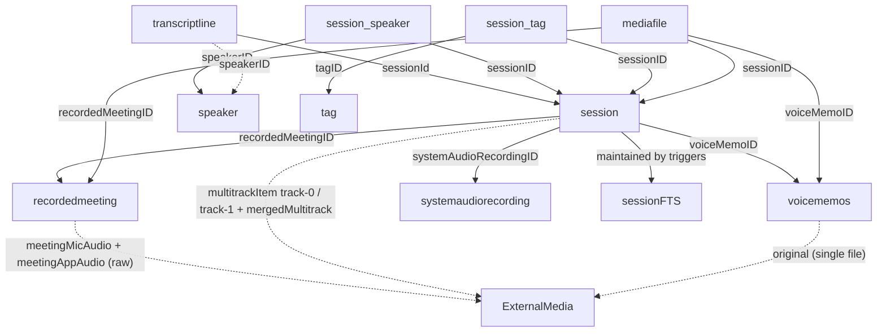

# MacWhisper Database

Reference for [MacWhisper](https://goodsnooze.gumroad.com/l/macwhisper)'s on-disk
state: the SQLite schema, the external media layout, and the conventions a tool
must respect to read — and eventually **write** — recordings that MacWhisper
treats as native.

This spec grounds two kinds of work:

1. The existing read-only skills that turn recordings into Markdown notes
   (`personal-whisper-to-markdown`, `personal-whisper-to-markdown-db`).
2. A planned split/combine engine that reconstructs full-fidelity sessions
   (all linked audio tracks) directly in `main.sqlite` + `ExternalMedia/`.

Everything below was verified by read-only inspection of a live database
(`PRAGMA table_info`, `.schema`, `SELECT`) except items explicitly called out
in §10 "Unverified assumptions".

## 1. Safety contract

This is the load-bearing rule, stated first on purpose.

- **Read-only by default.** Open the DB with a read-only URI
  (`sqlite3.connect("file:<path>?mode=ro", uri=True)` /
  `sqlite3 "file:<path>?mode=ro"`). Run only `PRAGMA`, `SELECT`, and `.schema`.
  Never open the live DB read-write while MacWhisper may be running — that risks
  corrupting its state.
- **Writes require all of the following, in order:**
  1. **MacWhisper fully quit** (not just backgrounded) — no process holding the
     DB or the WAL.
  2. **WAL checkpoint** so `main.sqlite` is self-contained
     (`PRAGMA wal_checkpoint(TRUNCATE)`), then back up the checkpointed file.
  3. **Timestamped backup** of `main.sqlite` (+ `-wal`/`-shm` if present) **and**
     every `ExternalMedia/` file the plan references.
  4. **Dry-run plan** built, shown, and approved before any mutation.
- **Never re-transcribe.** MacWhisper has already produced the transcript;
  re-running speech-to-text would diverge from what the user sees.
- **Never delete source sessions.** The engine only *adds* reconstructed
  sessions; the user deletes originals manually inside MacWhisper.
- **Never touch the WAL sidecars by hand.** SQLite manages `-wal`/`-shm`.

See §9 for the write-path mechanics in more detail.

## 2. Storage layout

All paths are under the macOS app-support directory (portable across users):

```
~/Library/Application Support/MacWhisper/
├── Database/
│   ├── main.sqlite           # the database (everything below lives here)
│   ├── main.sqlite-wal       # WAL sidecar (uncommitted writes live here while running)
│   ├── main.sqlite-shm       # shared-memory index for the WAL
│   ├── ExternalMedia/        # all recording audio: <UUID>_<token>_<8HEX>.m4a
│   └── Staging/              # transient import/processing area (often empty)
├── RecordedMeetings/         # meeting capture working dir (often empty at rest)
├── models/                   # downloaded ASR/diarization models
│   ├── argmaxinc/
│   ├── speakerkit/
│   └── whisperkitpro/
└── cli.sock                  # local control socket (do not touch)
```

- `Database/main.sqlite` is the single source of truth for sessions,
  transcripts, speakers, tags, and media-file rows.
- `Database/ExternalMedia/` holds the audio referenced by `mediafile.filename`
  (see §7). Audio is **not** stored as a BLOB in the DB.
- `Staging/` and `RecordedMeetings/` are working areas and are typically empty
  when MacWhisper is idle; do not depend on their contents.
- `models/` is downloaded model weights — irrelevant to read/write of
  recordings, listed for completeness.

## 3. Conventions

### 3.1 BLOB UUID / hex convention

Every primary key (`id`) and every foreign key is a 16-byte **BLOB UUID**, not a
string. Two stable string projections are used:

| Form | How | Example | Used by |
|---|---|---|---|
| Lowercase hex, no dashes (32 chars) | `lower(hex(id))` | `e9a5d54e10e24b5281913cd1bc8ab310` | note frontmatter (`source: macwhisper-db:<hex>`), internal keys |
| Uppercase canonical 8-4-4-4-12 | reformat the hex | `E9A5D54E-10E2-4B52-8191-3CD1BC8AB310` | the `ExternalMedia/` filename prefix (§7) |

To filter by a known hex id, convert back to bytes:
`WHERE id = ?` with `bytes.fromhex(hex_str)`. The byte order of `hex(id)` matches
the canonical UUID string byte-for-byte (verified: a `mediafile` filename's
UUID prefix equals the uppercased `hex()` of its linked FK — see §7).

### 3.2 Time model

MacWhisper mixes **two** time representations; this asymmetry is real and must be
handled per-column:

| Kind | Columns | Storage | Format / meaning |
|---|---|---|---|
| Wall-clock string | `dateCreated`, `dateUpdated`, `dateLastOpened`, `dateRetranscribed`, `recordedmeeting.date`, etc. | TEXT (declared `DATETIME`) | `'YYYY-MM-DD HH:MM:SS.fff'` in **UTC**. The `.fff` millisecond fragment is sometimes absent; a `T` separator is occasionally seen. |
| Mac Absolute Time | `dateDeleted` (on every soft-deletable table) | DOUBLE | Seconds since `2001-01-01 00:00:00 UTC`. `NULL` when not deleted. Unix = value + `978307200`. |
| Relative offset (ms) | `transcriptline.start`, `transcriptline.end` | INTEGER | Milliseconds **relative to session start**. |
| Duration (s) | `session.playbackDuration`, `recordedmeeting.duration`, `systemaudiorecording.duration` | DOUBLE | Seconds. `session.playbackDuration` is **often NULL** (MacWhisper derives it from the media). |
| Session offset (s) | `session.startTimeOffset` | DOUBLE | `0.0` in practice; a global shift applied to all line timestamps. |

Parsing rule (mirrors `lib/whisper` and `scripts/run.py`): accept both
`'%Y-%m-%d %H:%M:%S.%f'` and `'%Y-%m-%d %H:%M:%S'`, normalize a `T` separator to a
space, and treat the result as UTC.

### 3.3 Soft delete

Deletion is a two-tier model:

- **Soft delete**: rows with a `dateDeleted` column are "trashed" by setting
  `dateDeleted` to a Mac-absolute-time DOUBLE; the row and its media stay on
  disk. Tables with `dateDeleted`: `session`, `recordedmeeting`, `voicememos`,
  `systemaudiorecording`, `podcast`, `dictation`.
- **Filter rule**: every query filters live rows with `dateDeleted IS NULL`, on
  both the `session` and any joined parent (e.g. `recordedmeeting`).
- **Child tables have no `dateDeleted`** (`transcriptline`, `speaker`,
  `session_speaker`, `mediafile`, `session_tag`). They are removed only when the
  parent is *hard*-deleted, via `ON DELETE CASCADE`. To exclude lines of a
  soft-deleted session, join to the session and check `dateDeleted IS NULL`.

The engine **never** sets `dateDeleted` and never hard-deletes — see §1.

### 3.4 Schema versioning (GRDB migrations)

MacWhisper uses [GRDB.swift](https://github.com/groue/GRDB.swift). Applied
migrations are recorded as identifier strings in:

```sql
CREATE TABLE grdb_migrations (identifier TEXT NOT NULL PRIMARY KEY);
```

There is **no** reliable numeric `PRAGMA user_version`; the migration identifier
set is the version signal. Notable migrations that explain current column/table
shapes:

- `Rename MediaFileType 'regular' to 'original'` — why the single-file type is
  `original` (§7.2).
- `Rename displayName to userChosenTitle in session table`.
- `Rename session_translation table to session_fulltexttranslation`.
- `Add playbackType column to mediafile table`, `Add wordsJson column to
  transcriptline table`, `Add originalFileHash column to session table`,
  `Add soft delete columns`, and many `Add <col> to <table>` entries.

When adapting to drift, prefer feature-detection (§8) over assuming a migration
ran.

## 4. Relationship diagram



A `session` is the central object. It points *out* to at most one of
`recordedmeeting` (meeting), `voicememos` (voice memo), or
`systemaudiorecording` (system-audio capture). `transcriptline`, `session_speaker`,
`session_tag`, and some `mediafile` rows point *in* to it. Speakers and tags are
**global** and shared across sessions.

## 5. Core tables

Columns below are transcribed verbatim from the live `.schema`; the "meaning"
column is the documentation. `id` is always a BLOB-UUID primary key.

### 5.1 `session` — one row per recording

| Column | Type | Meaning |
|---|---|---|
| `id` | BLOB PK | Session UUID. |
| `dateCreated` | TEXT(DATETIME) | Recording start, UTC string (§3.2). Not null. |
| `dateUpdated` | TEXT(DATETIME) | Last edit. |
| `dateLastOpened` | TEXT(DATETIME) | Last opened in the app. |
| `textPreview` | TEXT | Short preview string shown in lists. |
| `aiSummary` | TEXT | AI-generated long summary (indexed by FTS). |
| `aiSummaryShort` | TEXT | AI-generated short summary. |
| `fullText` | TEXT | Denormalized full transcript text (indexed by FTS). |
| `userChosenTitle` | TEXT | User-entered title (was `displayName`). |
| `aiTitle` | TEXT | AI-suggested title. |
| `transcriptionDidSucceed` | BOOLEAN | 1 when transcription completed. |
| `modelEngine` | TEXT | e.g. `parakeetKitPro`. |
| `modelIdentifer` | TEXT | Model id, e.g. `nvidia_parakeet-v3`. **Note the misspelling** (§8). |
| `modelInputLanguage` | TEXT | Input language hint. |
| `detectedLanguage` | TEXT | Detected language code. |
| `hasBeenDiarized` | BOOLEAN | Speaker diarization ran. |
| `isMergedFromMultipleTracks` | BOOLEAN | 1 for meetings reconstructed from track-0/track-1 (§7.3). |
| `isFromYoutube` | BOOLEAN | Imported from YouTube. |
| `originalFilename` | TEXT | Source filename for imports. |
| `originalExtension` | TEXT | Source extension. |
| `originalFileHash` | TEXT | Hash of the imported source file; **empty/NULL in practice** (§10). |
| `startTimeOffset` | DOUBLE | Global timestamp offset, seconds. `0.0` in practice. |
| `wasTranslatedToEnglishDuringTranscription` | BOOLEAN | Translation flag. |
| `wasImportedFromWhisperFile` | BOOLEAN | Imported from a `.whisper` export. |
| `timeTakenToTranscribe` | DOUBLE | Seconds spent transcribing. |
| `playbackDuration` | DOUBLE | Media duration, seconds. **Often NULL** (§3.2). |
| `sourceAppBundleID` | TEXT | Bundle id of the capturing app. |
| `recordedMeetingID` | BLOB | FK → `recordedmeeting.id` (meeting sessions). |
| `voiceMemoID` | BLOB | FK → `voicememos.id` (voice-memo sessions). |
| `systemAudioRecordingID` | BLOB | FK → `systemaudiorecording.id`. |
| `podcastID` | BLOB | FK → `podcast.id`. |
| `downloadMetadataID` | BLOB | FK → `downloadmetadata.id`. |
| `isTransient` | BOOLEAN | In-flight/unsaved. |
| `isBeingRetranscribed` | BOOLEAN | Re-transcription in progress. |
| `dateRetranscribed` | TEXT(DATETIME) | Last re-transcription time. |
| `importedFromDefaults` | BOOLEAN | Seeded from app defaults. |
| `dateDeleted` | DOUBLE | Soft-delete marker, Mac absolute time (§3.3). |

Session **type** is inferred from which FK is set: `recordedMeetingID` →
meeting, `voiceMemoID` → voice memo, `systemAudioRecordingID` → meeting/system,
else other.

### 5.2 `transcriptline` — per-segment transcript

| Column | Type | Meaning |
|---|---|---|
| `id` | BLOB PK | Line UUID. |
| `sessionId` | BLOB NOT NULL | FK → `session.id`, `ON DELETE CASCADE ON UPDATE CASCADE`. (Note the lowercase `d` — `sessionId`, unlike the `sessionID` used on join tables.) |
| `start` | INTEGER NOT NULL | Start, ms relative to session start. |
| `end` | INTEGER NOT NULL | End, ms relative to session start. |
| `text` | TEXT NOT NULL | Segment text. |
| `speakerID` | BLOB | FK → `speaker.id` (nullable). |
| `isFavorite` | BOOLEAN NOT NULL | User-flagged line. |
| `wordsJson` | TEXT | Per-word timing JSON array: `[{"text","startTime","endTime"}, …]` (ms). |
| `dateCreated` / `dateUpdated` | TEXT(DATETIME) | Line timestamps. |

Indexed by `transcriptline_on_sessionId` and `idx_transcriptline_start`.

### 5.3 `speaker` — global speaker registry

| Column | Type | Meaning |
|---|---|---|
| `id` | BLOB PK | Speaker UUID. |
| `name` | TEXT NOT NULL | Display name, e.g. `Gary`, or `Speaker N` for stubs. |
| `color` | TEXT | Hex RGB swatch, e.g. `67B9AA`. |
| `isStub` | BOOLEAN | 1 = unnamed placeholder ("Speaker N"); resolved downstream. |
| `photoData` | BLOB | Optional avatar image bytes. |

Speakers are global; the same `speaker` row is referenced by many sessions.

### 5.4 `session_speaker` — session↔speaker membership

Join table. Columns: `sessionID` BLOB, `speakerID` BLOB, PK `(sessionID, speakerID)`,
both FKs `ON DELETE CASCADE`. Lists which speakers appear in a session.

### 5.5 `mediafile` — audio file rows

| Column | Type | Meaning |
|---|---|---|
| `id` | BLOB PK | Media-file UUID (distinct from the filename's UUID prefix). |
| `filename` | TEXT NOT NULL | Basename under `ExternalMedia/` (§7). |
| `type` | TEXT NOT NULL | Media role enum (§7.2). |
| `playbackType` | TEXT NOT NULL | Default `'audioOnly'` (§7.2). |
| `fileExtension` | TEXT | e.g. `m4a`. |
| `dateCreated` | TEXT(DATETIME) | Row creation time. |
| `sessionID` | BLOB | FK → `session.id` (set for `multitrackItem`/`mergedMultitrack`/imported `original`). |
| `recordedMeetingID` | BLOB | FK → `recordedmeeting.id` (set for `meetingMicAudio`/`meetingAppAudio`; `sessionID` NULL). |
| `voiceMemoID` | BLOB | FK → `voicememos.id` (set for voice-memo `original`). |
| `systemAudioRecordingID` | BLOB | FK → `systemaudiorecording.id`. |
| `podcastID` | BLOB | FK → `podcast.id`. |
| `dictationID` | BLOB | FK → `dictation.id`. |
| `speakerID` | BLOB | FK → `speaker.id` (per-speaker media, rare). |

Exactly one of the FK columns is set per row, and it determines the filename's
UUID prefix (§7).

### 5.6 `recordedmeeting` — meeting capture metadata

| Column | Type | Meaning |
|---|---|---|
| `id` | BLOB PK | Meeting UUID (also the mic/app-audio filename prefix). |
| `date` | TEXT(DATETIME) | Meeting time, UTC string. |
| `title` | TEXT | Meeting title (may be NULL; defaults cleared by a migration). |
| `bundleIdentifier` | TEXT NOT NULL | Capturing app bundle id. |
| `appName` | TEXT NOT NULL | App name, e.g. `Chrome`, `Slack`, `zoom.us`. |
| `matchedCalendarTitle` | TEXT | Calendar-event title matched at capture. |
| `duration` | DOUBLE | Meeting length, seconds. |
| `dateCreated` / `dateUpdated` | TEXT(DATETIME) | Row timestamps. |
| `dateDeleted` | DOUBLE | Soft-delete marker. |

A meeting's raw mic + app audio attach to **this** row (via
`mediafile.recordedMeetingID`), while the merged + per-track audio attach to the
`session` row (§7.3).

### 5.7 `voicememos` — voice-memo metadata

| Column | Type | Meaning |
|---|---|---|
| `id` | BLOB PK | Voice-memo UUID (also the `voicememo` filename prefix). |
| `dateCreated` | TEXT(DATETIME) | Creation time. |
| `mediaFileID` | BLOB | FK → `mediafile.id` for the single audio file. |
| `title` | TEXT | Memo title. |
| `dateDeleted` | DOUBLE | Soft-delete marker. |

Voice memos are the simplest single-track shape: one `voicememos` row → one
`mediafile` (`type='original'`) → one session via `session.voiceMemoID`.

### 5.8 `systemaudiorecording` — system-audio capture metadata

Same shape as `recordedmeeting` minus calendar matching: `id`, `date`, `title`,
`bundleIdentifier` (nullable here), `appName` NOT NULL, `duration`, `dateCreated`,
`dateUpdated`, `dateDeleted`. **0 rows in the inspected DB** — the system-audio
path is documented from schema only and is best-effort (§10).

### 5.9 `tag` / `session_tag` — built-in tagging

- `tag`: `id` BLOB PK, `name` TEXT NOT NULL **UNIQUE**, `color` TEXT NOT NULL.
- `session_tag`: `sessionID` BLOB, `tagID` BLOB, PK `(sessionID, tagID)`, both FKs
  `ON DELETE CASCADE`.

MacWhisper's native tags (distinct from the note-workspace tag vocabulary). **0
rows in the inspected DB**; the read-only skills pull these as supplementary
tag input when present.

### 5.10 Other tables (not central, listed for completeness)

| Table | Role |
|---|---|
| `dictation` + `dictationFTS*` | The macOS dictation feature (push-to-talk transcription into other apps). Separate from sessions; has its own FTS5 mirror and triggers (`__dictationFTS_ai/ad/au`). 0 rows here. |
| `session_fulltexttranslation` | Whole-session translated text (`languageCode`, `fullText`). |
| `transcriptline_translation` | Per-line translations (`start`/`end`/`text`/`speakerID`). |
| `podcast` | Podcast-import metadata. |
| `downloadmetadata` | YouTube/URL import metadata (`sourceURL`, `youtube*`). |

## 6. Full-text search (FTS5)

`sessionFTS` is an **external-content** FTS5 table over `session`:

```sql
CREATE VIRTUAL TABLE "sessionFTS" USING fts5(
  id, fullText, aiSummary, userChosenTitle, content='session'
);
```

Because `content='session'`, the FTS index stores no copy of the text itself; it
keys on `session.rowid` and reads the columns back from `session`. SQLite also
materializes four shadow tables that you must **not** edit directly:

- `sessionFTS_data`, `sessionFTS_idx`, `sessionFTS_docsize`, `sessionFTS_config`.

Index maintenance is automatic via three triggers on `session`:

| Trigger | Fires | Effect |
|---|---|---|
| `__sessionFTS_ai` | AFTER INSERT | Inserts `(rowid, id, fullText, aiSummary, userChosenTitle)` into `sessionFTS`. |
| `__sessionFTS_ad` | AFTER DELETE | Issues the FTS `'delete'` command with the **old** row values. |
| `__sessionFTS_au` | AFTER UPDATE | `'delete'` of old values, then re-insert of new values. |

Write-path consequence: a normal `INSERT INTO session (...)` fires
`__sessionFTS_ai` and indexes the session automatically — **do not** write to the
`sessionFTS_*` shadow tables. To make a reconstructed session searchable in-app,
populate `session.fullText` (and `textPreview`) with the transcript text; the
visible transcript itself is driven by `transcriptline` rows, not by `fullText`.
(`dictation` has the identical pattern with `dictationFTS`.)

## 7. Media files

### 7.1 Filename naming

Files in `ExternalMedia/` follow:

```
<UUID>_<token>_<8HEX>.<ext>
```

- `<UUID>` — uppercase canonical UUID (8-4-4-4-12) of the **owning FK row**
  (verified equal to `upper(hex(<fk>))`): the `recordedmeeting.id` for
  meeting raw audio, the `session.id` for merged/track audio, the
  `voicememos.id` for a voice memo.
- `<token>` — a human-readable role token (kebab-case) that is **not** the same
  string as `mediafile.type` (§7.2).
- `<8HEX>` — an 8-character uppercase hex suffix, unique per file. Its
  derivation is **unverified** (§10) — it is *not* `session.originalFileHash`
  (empty in practice). Treat it as opaque for now.
- `<ext>` — usually `m4a`.

Example (synthetic): `A1B2C3D4-0000-4000-8000-000000000000_track-0_DEADBEEF.m4a`.

### 7.2 `type` and `playbackType` enums

`mediafile.type` (the DB enum) maps to a different filename token:

| `mediafile.type` | filename token | UUID prefix is | FK column set | sessionID |
|---|---|---|---|---|
| `meetingMicAudio` | `mic-audio` | `recordedmeeting.id` | `recordedMeetingID` | NULL |
| `meetingAppAudio` | `app-audio` | `recordedmeeting.id` | `recordedMeetingID` | NULL |
| `multitrackItem` | `track-0` / `track-1` | `session.id` | `sessionID` | set |
| `mergedMultitrack` | `merged-audio` | `session.id` | `sessionID` | set |
| `original` | `voicememo` (or imported name) | `voicememos.id` or `session.id` | `voiceMemoID` or `sessionID` | varies |

(`original` was renamed from `regular` by a migration; it is the single-file
type used for voice memos and direct imports.)

`mediafile.playbackType`: only `'audioOnly'` observed (the column default). A
`video` value is expected for video imports but was not present to verify (§10).

### 7.3 Reconstruction matrix (what a full-fidelity session needs)

Verified counts on a meeting: 3 media rows on the `session`
(`track-0`, `track-1`, `merged-audio`) + 2 media rows on the `recordedmeeting`
(`mic-audio`, `app-audio`) = 5 files total.

**Meeting (multi-track) — the primary path:**

| Object | Rows to create | Media (`type`, filename token) |
|---|---|---|
| `recordedmeeting` (id = `RM`) | 1 | `meetingMicAudio` `<RM>_mic-audio_<8HEX>`, `meetingAppAudio` `<RM>_app-audio_<8HEX>` (FK `recordedMeetingID=RM`, `sessionID` NULL) |
| `session` (id = `S`) | 1, `recordedMeetingID=RM`, `isMergedFromMultipleTracks=1` | `multitrackItem` `<S>_track-0_<8HEX>`, `multitrackItem` `<S>_track-1_<8HEX>`, `mergedMultitrack` `<S>_merged-audio_<8HEX>` (FK `sessionID=S`) |
| `transcriptline` × N | per segment | — |
| `speaker` / `session_speaker` | reuse or create | — |

**Voice memo (single-track) — the simple path:**

| Object | Rows to create | Media |
|---|---|---|
| `voicememos` (id = `VM`) | 1, `mediaFileID` → the media row | — |
| `mediafile` | 1, `type='original'`, `voiceMemoID=VM`, `<VM>_voicememo_<8HEX>` | one file |
| `session` (id = `S`) | 1, `voiceMemoID=VM` | — |
| `transcriptline` × N | per segment | — |

**System audio (single-track) — best-effort:** mirror the voice-memo shape via
`systemaudiorecording` + `session.systemAudioRecordingID`. Untested (§10).

## 8. Schema-drift notes & `PRAGMA table_info` adaptation

MacWhisper changes column spellings/names across releases. Two confirmed
gotchas:

- **`modelIdentifer` typo.** The session column is literally
  `modelIdentifer` (missing the second `i`). No migration fixes it, so it
  persists. Code must tolerate both `modelIdentifer` and a future
  `modelIdentifier`.
- **`playbackDuration` vs `duration`.** Session duration is `playbackDuration`
  (DOUBLE, often NULL). `duration` lives on `recordedmeeting` /
  `systemaudiorecording`, not `session`. Code that wants "the session duration"
  should prefer `playbackDuration` and fall back defensively.

**Adaptation pattern** (as used by `agents/skills/.../scripts/run.py`): before
building SQL, read the live column set and pick column names by presence rather
than assumption —

```python
cur.execute("PRAGMA table_info(session)")
cols = {r["name"] for r in cur.fetchall()}
model_col = "modelIdentifer" if "modelIdentifer" in cols else (
    "modelIdentifier" if "modelIdentifier" in cols else None)
duration_col = "playbackDuration" if "playbackDuration" in cols else (
    "duration" if "duration" in cols else None)
has_succeeded = "transcriptionDidSucceed" in cols
# select the resolved columns, emitting NULL for any that are absent
```

Degrade gracefully: when a column is missing, select `NULL` for it rather than
failing the query. Use `grdb_migrations` (§3.4) only as a secondary signal;
`PRAGMA table_info` is authoritative for what columns actually exist right now.

## 9. Write path (for the split/combine engine)

This section is forward-looking; the engine is built in a later step. It records
the contract the engine must satisfy, consistent with §1.

1. **Preconditions**: MacWhisper quit; DB checkpointed; timestamped backup of
   `main.sqlite` + every referenced `ExternalMedia/` file taken.
2. **Insert order** (respect FK direction): parent metadata row
   (`recordedmeeting` / `voicememos` / `systemaudiorecording`) → `session` →
   `mediafile` rows → `speaker`/`session_speaker` (reuse existing speakers by id
   where possible) → `transcriptline` rows → `session_tag` (optional).
3. **Copy audio** into `ExternalMedia/` with names matching the new UUIDs and
   `mediafile.filename` exactly (§7.1). `ffmpeg`/`ffprobe` 8.x are available for
   any track muxing/duration probing.
4. **FTS**: populate `session.fullText`/`textPreview`; the insert triggers
   maintain `sessionFTS` automatically (§6) — never write the shadow tables.
5. **Timestamps**: write `dateCreated` etc. as UTC `'YYYY-MM-DD HH:MM:SS.fff'`
   strings; leave `dateDeleted` NULL (§3.2–3.3).
6. **Never** re-transcribe and **never** delete or soft-delete source rows.
7. After writing, the first real run is validated against a **DB backup copy**
   opened in MacWhisper before ever touching the live DB.

## 10. Unverified assumptions

These are explicitly *not* confirmed by inspection and must be tested against a
DB **backup** before the first real write run:

1. **8-hex filename suffix semantics.** Whether `<8HEX>` is a content hash that
   MacWhisper recomputes/validates on load, or just a random per-file
   disambiguator. Confirmed only that it is *not* `session.originalFileHash`
   (empty in the inspected DB). If MacWhisper validates it, the engine must
   replicate the exact derivation; if not, any unique 8-hex value is fine.
2. **`mergedMultitrack` necessity.** Whether the merged-audio row+file must
   pre-exist for a meeting session to play/appear, or whether MacWhisper
   regenerates it on demand from `track-0`/`track-1`. Plan: provide it for full
   fidelity, then test whether omitting it still renders the session.
3. **`originalFileHash` use.** Empty/NULL in the inspected DB. Unknown when
   MacWhisper populates it (likely only for file/`.whisper` imports) and whether
   it gates playback, dedup, or re-import. Assume NULL-safe / optional.
4. **`playbackType` values beyond `audioOnly`.** Only `audioOnly` observed; a
   `video` (or similar) value is presumed for video media but unverified.
5. **System-audio path.** `systemaudiorecording` had 0 rows; the single-track
   linkage is inferred from schema symmetry with voice memos and is untested.
6. **FTS insert sufficiency.** Assumed a normal `INSERT INTO session` (firing
   `__sessionFTS_ai`) makes the session searchable without shadow-table writes.
   Verify with a search query after a test insert into a backup.
7. **`isMergedFromMultipleTracks` / rendering flags.** Assumed setting it to `1`
   for reconstructed meetings (and `0` for single-track) matches MacWhisper's
   expectations; confirm the UI renders the multi-track player correctly.

## Related

- Read-only consumers: `agents/skills/personal-whisper-to-markdown/SKILL.md`,
  `agents/skills/personal-whisper-to-markdown-db/SKILL.md`, and the shared
  library `agents/skills/lib/whisper/`.
- Documentation conventions: `standards/documentation.md`.
