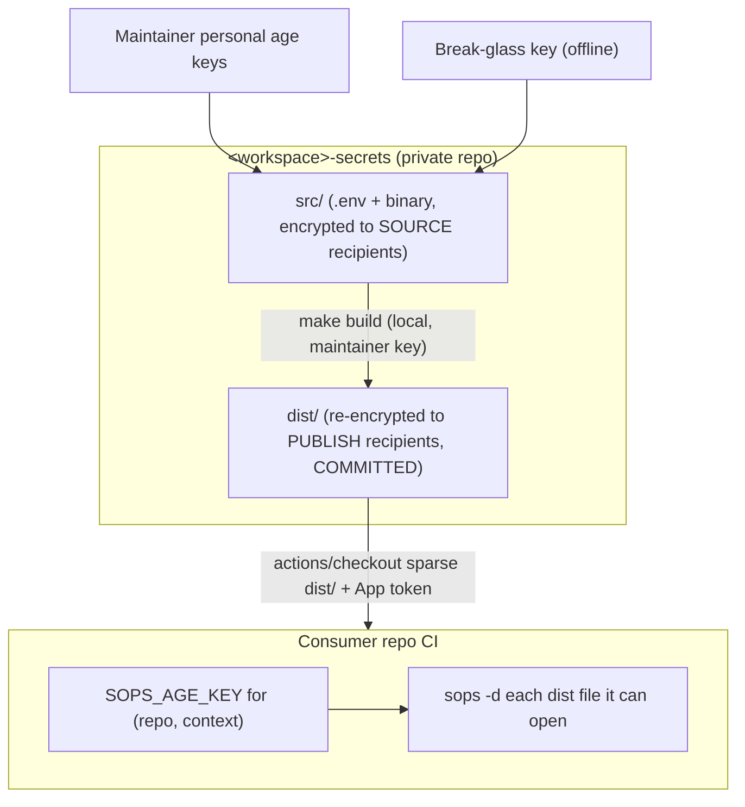

# Secrets via a GitHub repo

Specification for managing secrets for an entire estate through a single private
GitHub repo, using SOPS + age. Portable across projects: it needs nothing but
GitHub (no cloud KMS, no 1Password, no external secret store), so it works the
same for a pure-frontend project and a server-backed one.

> Status: specification / personal standard. Not specific to one repo.
> Placeholders: `<workspace>` (e.g. `nowline`), `<org>` (e.g. `lolay`).

## Goals

- One source of truth for all secrets in an estate, version-controlled.
- Coarse access control by **file** (topic), fine access control by **key**.
- Access granted by named **groups** of `repo__context` identities, mapped to
  files explicitly — no inherited or implied access. See
  [Groups and the access matrix](#groups-and-the-access-matrix).
- Per-consumer, per-context keys so a leak is contained and revocable.
- No always-on machine key that can read the editable source secrets.
- Cloud-agnostic: GitHub + age only.

## How it works in one picture



Two independent gates protect a consumer:

1. **Coarse / can you fetch the ciphertext at all** — a read-only **Secrets
   GitHub App** grants `contents: read` on the secrets repo so CI can check it
   out. This is per-repo.
2. **Fine / what can you actually decrypt** — the consumer's `SOPS_AGE_KEY`.
   A consumer may pull every file but only decrypts the ones encrypted to its
   key. All access control lives here.

The key never decrypts more than it is a recipient of, so the second gate is the
real access-control boundary; the App is just "are you allowed to see the
(encrypted) blobs."

---

## Consumer side (start here)

This is what every consuming repo wires up. It is deliberately small.

### Identity model: `(repo, context)`

Each consumer gets its own age keypair **per execution context**, because
GitHub keeps separate secret stores that can each hold a secret of the **same
name** with a **different value**:

- `actions` — normal CI
- `agent` — agentic / Copilot coding-agent runs (confirmed separate store)
- `codespaces`
- `dependabot`

The secret is **always named `SOPS_AGE_KEY`**; only the value differs per store.
This is how you give an agent *less* than actions: the agent's key is a
recipient of fewer files than the actions key in the same repo.

> Provisioning note: `gh secret set SOPS_AGE_KEY --app actions|codespaces|dependabot`
> covers three stores. The `agent`/Copilot store may need the GitHub UI or its
> own API endpoint — verify the exact command for your setup before relying on
> it. `dependabot` also cannot mint App tokens the normal way, so a Dependabot
> job that needs secrets must have them pre-staged rather than fetched live.

The identity is always `(repo, context)`. Provision the `actions` context for a
repo first; add `agent` / `codespaces` / `dependabot` for that repo when a
workflow in that context needs secrets. Each context key is one more recipient on
the files it can open.

### The consumer step

The consumer checks out `dist/` (HEAD is always the latest) and decrypts what its
key can open:

```yaml
- uses: actions/create-github-app-token@v1
  id: tok
  with:
    app-id: ${{ vars.SECRETS_APP_ID }}
    private-key: ${{ secrets.SECRETS_APP_PRIVATE_KEY }}
    owner: <org>
    repositories: <workspace>-secrets
    permission-contents: read

- uses: actions/checkout@v4
  with:
    repository: <org>/<workspace>-secrets
    token: ${{ steps.tok.outputs.token }}
    sparse-checkout: dist
    path: _secrets
    fetch-depth: 1

- uses: nhedger/setup-sops@v2   # installs the sops binary; age support is built in

- name: Decrypt what this key can open
  env:
    SOPS_AGE_KEY: ${{ secrets.SOPS_AGE_KEY }}   # this (repo, context)'s private key
  run: make -C _secrets dist-decrypt >> "$GITHUB_ENV"   # .env -> env; binaries -> _secrets/dist/<path> (next to .sops)
```

Notes:

- **One shipped entrypoint.** `make dist-decrypt` (script `dist-decrypt.sh`) lives
  in the secrets repo and travels with the checkout, so the decrypt logic is
  defined once. If it changes, consumers pick it up at HEAD with no workflow edit
  — nothing to copy-paste or keep in sync per repo.
- **Always latest, no versioning needed.** `actions/checkout` at HEAD of `main`
  gives the newest `dist/`. Pin `ref:` to a SHA or tag only if you want a
  reproducible build.
- **What the checkout pulls.** Cone-mode `sparse-checkout: dist` brings `dist/`
  plus the repo's **root files** (`Makefile`, `dist-decrypt.sh`) — never `src/`,
  `scripts/`, or `keys/`. That is why the entrypoint is a root-level script.
- The same step works for Codespaces; only the *store* the `SOPS_AGE_KEY` is read
  from changes.
- **Binary secrets** (`.p8`, `.p12`, certs) are written by the same target next to
  their `.sops` file (`_secrets/dist/<path>`, suffix stripped) instead of env —
  see [Non-`.env` secrets](#non-env-secrets-binary-p8-p12-certs-mobileprovision).
- **Why a target, not an action.** SOPS has age built in, so only the `sops`
  binary is needed (`nhedger/setup-sops`); `make` is preinstalled on runners.
  There is no official decrypt action and none takes wildcards (SOPS decrypts one
  file per invocation), so a shipped script that does the globbing/recursion is
  the simplest general form and keeps the logic in the secrets repo.

---

## The secrets repo

### Structure

```text
<workspace>-secrets/                       private repo
├─ .sops.yaml                              SOURCE recipients (maintainer + break-glass pubs) for src/ and keys/
├─ .gitignore                              track only *.sops under src/ dist/ keys/ (plaintext can't be committed)
├─ Makefile                                init / doctor / src-encrypt / src-decrypt / build / dist-decrypt / set-keys / mint / rotate / verify / clean
├─ README.md                               short pointer to this spec
├─ access.map                              SOURCE OF TRUTH: groups + file -> groups/identities (logical names, no .sops)
├─ breakglass.pub                          break-glass PUBLIC key (a publish recipient on every file)
├─ dist-decrypt.sh                         CONSUMER entrypoint (root-level so cone-mode checkout ships it)
├─ src/                                    editable originals; only *.sops is tracked (plaintext sibling is gitignored)
│  ├─ oss.env.sops                         .env topics (dotenv)
│  ├─ commercial.env.sops
│  ├─ payments.env.sops
│  └─ ios/                                 binary blobs (certs, keys); any folder depth is allowed
│     ├─ AuthKey_BV7QPDLS45.p8.sops
│     └─ distribution.p12.sops
├─ dist/                                   COMMITTED, re-encrypted per-file to PUBLISH recipients (mirrors src/)
│  ├─ oss.env.sops
│  ├─ commercial.env.sops
│  ├─ payments.env.sops
│  └─ ios/
│     ├─ AuthKey_BV7QPDLS45.p8.sops
│     └─ distribution.p12.sops
├─ keys/
│  └─ repos.env.sops                       SOPS-enc to maintainers + break-glass:
│                                          <repo>__<context>__public / __private for every consumer
├─ scripts/
│  ├─ build.sh                             resolve publish recipients (transient) + re-encrypt src/ -> dist/
│  ├─ crypt.sh                             src <-> .sops sibling (safe + idempotent)
│  ├─ set-consumer-keys.sh                 fan SOPS_AGE_KEY out to all (or one) repo__context
│  ├─ mint-consumer.sh                     generate a NEW keypair (refuses to overwrite an existing one)
│  ├─ rotate-consumer.sh                   replace an EXISTING keypair
│  └─ verify.sh
└─ .githooks/
   └─ pre-commit                           keyless: refuse non-.sops + assert src/<f>.sops paired with dist/<f>.sops
```

**The `.sops` convention.** Every encrypted file on disk carries a trailing
`.sops` suffix (`oss.env.sops`, `ios/AuthKey_BV7QPDLS45.p8.sops`). A decrypted
file is the same name **without** the suffix, written right next to its
ciphertext (`oss.env` beside `oss.env.sops`). `.gitignore` tracks only `*.sops`
under `src/`, `dist/`, and `keys/`, so a decrypted plaintext sibling literally
cannot be committed — the suffix is the safety boundary, not just a hook. The
`access.map` and the matrix below use the **logical** name (no `.sops`); the
scripts add/strip the suffix.

The tracked files are exactly `.sops.yaml`, `.gitignore`, `access.map`,
`breakglass.pub`, `dist-decrypt.sh`, and the `*.sops` files under `src/`, `dist/`,
and `keys/`. **Publish recipient lists are never committed** — `build` computes
them transiently from `access.map` + `keys/repos.env.sops` at encrypt time. `src/`
may use any folder depth; `build` mirrors the exact layout into `dist/`. There is
intentionally **no `.github/workflows/` that holds a key**; an optional *keyless*
freshness-check workflow is described later.

```gitignore
# .gitignore — only *.sops is tracked under src/ dist/ keys/; plaintext siblings are ignored
/src/**
/dist/**
/keys/**
!/src/**/
!/dist/**/
!/keys/**/
!/src/**/*.sops
!/dist/**/*.sops
!/keys/**/*.sops
```

### Groups and the access matrix

Files are the coarse access unit. Name them by topic, and grant access with named
**groups** of `repo__context` identities. A group is just a label for a set of
identities — there is **no inheritance or implied access**. Every file lists
exactly the groups (or individual `repo__context` keys) allowed to decrypt it.

Group names by sensitivity (`oss`, `commercial`, `payments`) are a useful
convention, but carry no ordering: `commercial.env` is readable by the commercial
group only because that group is listed on it, not because of any ladder. SOPS
dotenv format keeps keys readable and values encrypted, so diffs stay reviewable.

Worked example estate (cells are `repo__context`; the `actions` context is shown —
a repo may also have `agent`, `codespaces`, etc.):

| file \ identity (group)  | nowline (oss) | nowline-site (oss) | nowline-app (commercial) | nowline-infra (commercial) | nowline-api (payments) |
|--------------------------|:---:|:---:|:---:|:---:|:---:|
| `oss.env`                | yes | yes | yes | yes | yes |
| `commercial.env`         |     |     | yes | yes | yes |
| `payments.env`           |     |     |     |     | yes |
| `ios/AuthKey_*.p8`       |     |     | yes |     |     |
| `ios/distribution.p12`   |     |     | yes |     |     |

Each row is exactly the access list for that file — nothing is inferred:

- `oss.env` lists `@oss`, `@commercial`, and `@payments`, so every identity reads
  it (you list those groups; it is not automatic).
- `commercial.env` lists `@commercial` and `@payments`, not `@oss`.
- `payments.env` lists only `@payments` — a single repo here (`nowline-api`).
- The iOS signing assets list only `nowline-app__actions` — narrower than any
  group. Note `@payments`, despite being the most sensitive group, has **no**
  access to them: because groups do not inherit, "most sensitive" never implies
  "reads everything."

> Multi-project repos: if one `<workspace>-secrets` repo serves several projects,
> prefix files with the project — `web-oss.env`, `mobile-commercial.env` — so the
> topic stays the access unit while names stay unambiguous.

### Two keyrings

- **SOURCE recipients** = maintainer personal keys + break-glass. This list **is
  committed** — it lives in `.sops.yaml`, which is the source recipients file.
  Only these keys can read `src/` (and `keys/repos.env.sops`). Re-encryption to
  `dist/` happens **locally** with a maintainer key, so no machine key ever reads
  source.
- **PUBLISH recipients** (per file) = the consumer `(repo, context)` keys allowed
  to decrypt that file, plus break-glass. `build` resolves them from `access.map`
  + `keys/repos.env.sops` at encrypt time and feeds them to SOPS; the lists are
  transient and never committed. They cannot open `src/`.

`.sops.yaml` is the committed source-recipients list (the equivalent of a source
`recipients.txt`). It is kept as `.sops.yaml` rather than a flat file because
that is the only form SOPS applies **automatically**: `make src-encrypt` (and `sops
updatekeys` on rotation) read it directly with no `SOPS_AGE_RECIPIENTS` plumbing.
A separate `recipients.txt` for source would just duplicate it and invite drift.
The asymmetry with publish is intentional: source is one static set for
everything under `src/`, so a static file fits; publish is **per file** and
derived from `access.map`, so it cannot be static and is computed at build time.

```yaml
# .sops.yaml — committed SOURCE recipients (maintainers + break-glass)
creation_rules:
  # everything under src/ (dotenv + binary) and the key registry encrypt to this set
  - path_regex: ^(src|keys)/.*
    age: >-
      age1alice...,
      age1bob...,
      age1breakglass...      # same key as breakglass.pub
```

Adding/removing a maintainer is therefore a one-file change: edit the `age:` list
in `.sops.yaml`, then `sops updatekeys src/**/*.sops keys/repos.env.sops` to
re-encrypt the existing source to the new set.

### `access.map` — the source of truth

You edit this. Define groups as sets of `repo__context` identities at the top,
then list which groups (or individual `repo__context` keys) may decrypt each file.
There is no inheritance — list every group that should have access.

```text
# --- groups: named sets of repo__context identities ---
@oss        = nowline__actions nowline-site__actions
@commercial = nowline-app__actions nowline-infra__actions
@payments   = nowline-api__actions

# --- file : groups / identities allowed to DECRYPT it (no inheritance) ---
oss.env:                    @oss @commercial @payments
commercial.env:             @commercial @payments
payments.env:               @payments

# a file may grant a single identity directly, narrower than any group:
ios/AuthKey_BV7QPDLS45.p8:  nowline-app__actions
ios/distribution.p12:       nowline-app__actions
```

At build time `build.sh` expands each `@group` to its `repo__context` identities,
resolves each one's public key from `keys/repos.env.sops`, adds break-glass, and
re-encrypts `src/<file>.sops` straight to `dist/<file>.sops` (it adds the suffix;
`access.map` lists the logical name). The resolved recipient lists are transient
and never committed.

### `keys/repos.env.sops` — the consumer key registry

One SOPS-encrypted dotenv (recipients: maintainers + break-glass) holding every
consumer keypair:

```dotenv
nowline-app__actions__public=age1...
nowline-app__actions__private=AGE-SECRET-KEY-1...
nowline-app__agent__public=age1...
nowline-app__agent__private=AGE-SECRET-KEY-1...
nowline-api__actions__public=age1...
nowline-api__actions__private=AGE-SECRET-KEY-1...
```

> Delimiter caveat: repo names contain dashes (`nowline-app`), so
> `nowline-app-actions-private` is ambiguous to split. Use a `__` separator —
> `<repo>__<context>__public` / `__private` — so parsing is unambiguous.

This file is decrypted **only** by maintainer-local targets (`make build`,
`make set-keys`). Nothing automated needs the consumer *private* keys, which
keeps their blast radius small.

### Non-`.env` secrets (binary: `.p8`, `.p12`, certs, mobileprovision)

Not every secret is dotenv. App Store Connect API keys (`AuthKey_<KEYID>.p8`),
iOS distribution certs (`.p12` / `.cer`), and provisioning profiles
(`.mobileprovision`) are binary blobs. SOPS handles these with its **binary**
type, so they reuse the *same* repo, recipients, and `SOPS_AGE_KEY` — one tool,
one access model, one matrix:

```bash
# add a binary source secret: drop the plaintext into src/ at any depth, then encrypt it
cp /path/to/AuthKey_BV7QPDLS45.p8 src/ios/AuthKey_BV7QPDLS45.p8
make src-encrypt FILE=ios/AuthKey_BV7QPDLS45.p8   # -> src/ios/AuthKey_BV7QPDLS45.p8.sops (plaintext removed)

# inspect locally (writes the gitignored plaintext sibling; 'make clean' removes it)
make src-decrypt FILE=ios/AuthKey_BV7QPDLS45.p8   # -> src/ios/AuthKey_BV7QPDLS45.p8
```

`make build` re-encrypts them to each file's publish recipients exactly like the
`.env` files — it re-encrypts every file declared in `access.map`, choosing
`dotenv` for `*.env` and `binary` for everything else. They appear in `access.map`
and the matrix as ordinary files, so the App Store Connect key can be scoped to
just the one repo that ships the app.

On the consumer, `make dist-decrypt` writes each decryptable binary **next to its
ciphertext** — `_secrets/dist/ios/AuthKey_BV7QPDLS45.p8` beside the `.sops` file
— with the filename preserved (App Store Connect needs the key ID in the
filename, which the layout keeps). Point the toolchain at those paths, or copy
them where a tool insists:

```yaml
- name: Use iOS signing secrets   # after the dist-decrypt step above
  run: |
    set -euo pipefail
    mkdir -p ~/private_keys
    cp _secrets/dist/ios/AuthKey_BV7QPDLS45.p8 ~/private_keys/
    security import _secrets/dist/ios/distribution.p12 -k <keychain> ...
```

> Size note: SOPS binary base64-inflates the blob ~33%; fine for keys/certs (KB
> range), but don't commit large binaries. Signing material is usually the most
> damaging single thing to leak, so scope it to one repo.

---

## Maintainer Makefile

```make
# One-time local setup: point git at the repo hooks, make scripts executable, check tools
init:        ## run once after cloning
	git config core.hooksPath .githooks
	@chmod +x scripts/*.sh dist-decrypt.sh .githooks/* 2>/dev/null || true
	@$(MAKE) doctor

# Read-only tool check (no secrets touched)
doctor:      ## verify required tooling is installed
	@fail=; for t in sops age-keygen gh; do \
	  command -v $$t >/dev/null && echo "ok    $$t  ($$($$t --version 2>&1 | head -1))" \
	    || { echo "MISSING $$t"; fail=1; }; \
	done; \
	gh auth status >/dev/null 2>&1 && echo "ok    gh authenticated" \
	  || echo "warn  gh not authenticated (needed for set-keys)"; \
	[ -z "$$fail" ] || { echo "install the missing tools, then re-run 'make doctor'"; exit 1; }

# Decrypt source secrets to a plaintext sibling (foo.sops -> foo) so you can edit with any tool.
# No FILE = all of src/. The plaintext is gitignored; re-encrypt with 'make src-encrypt'.
src-decrypt: ## make src-decrypt [FILE=oss.env]
	@./scripts/crypt.sh decrypt $(FILE)

# Encrypt a plaintext sibling to SOURCE recipients (foo -> foo.sops) and delete the plaintext.
# Also how you encrypt a NEW file dropped into src/. No FILE = every plaintext under src/.
src-encrypt: ## make src-encrypt [FILE=ios/AuthKey_BV7QPDLS45.p8]
	@./scripts/crypt.sh encrypt $(FILE)

# Build dist/ : re-encrypt each file declared in access.map from src/*.sops to dist/*.sops
build:
	./scripts/build.sh

# Decrypt dist/ with the current $SOPS_AGE_KEY (the CONSUMER entrypoint; also used to verify a key).
# .env -> KEY=VALUE on stdout; binary -> sibling next to the .sops file. Ships with the cone-mode checkout.
dist-decrypt: ## SOPS_AGE_KEY=... make dist-decrypt
	@bash ./dist-decrypt.sh dist

# Push consumer keys to GitHub. No args = EVERY repo__context in repos.env.sops; scope with REPO/CONTEXT.
set-keys:    ## make set-keys [REPO=nowline-app] [CONTEXT=actions]
	./scripts/set-consumer-keys.sh "$(REPO)" "$(CONTEXT)"

# Mint a NEW consumer keypair into keys/repos.env.sops (refuses if it already exists — use rotate)
mint:        ## make mint REPO=nowline-app CONTEXT=actions
	./scripts/mint-consumer.sh $(REPO) $(CONTEXT)

# Rotate (replace) an EXISTING consumer key (new keypair -> repos.env.sops -> set-keys -> build)
rotate:      ## make rotate REPO=nowline-app CONTEXT=actions
	./scripts/rotate-consumer.sh $(REPO) $(CONTEXT)

# Lint: every access.map entry has a key; every src file round-trips; dist fresh
verify:
	./scripts/verify.sh

# Remove decrypted plaintext siblings (everything not *.sops) under src/ and dist/
clean:       ## delete local plaintext
	@find src dist -type f ! -name '*.sops' -print -delete 2>/dev/null || true
```

`make init` is the one command a new maintainer runs after cloning: it wires the
git hooks path (so the freshness/plaintext guards fire), marks the scripts
executable, and runs `doctor`. `make src-decrypt`/`make src-encrypt` replace the
old in-editor `edit`: `src-decrypt` writes a plaintext sibling (`oss.env` next to
`oss.env.sops`) for editing with any tool; `src-encrypt` re-encrypts that sibling
back to `oss.env.sops` and deletes the plaintext. The plaintext is gitignored, so
it can never be committed; `make clean` removes any siblings you left behind. The
`src-`/`dist-` prefixes make the direction explicit: `src-*` operate on the
editable originals (maintainers only), `dist-decrypt` operates on the published
ciphertext (the consumer side).

`make dist-decrypt` is the **consumer entrypoint**, shipped in the repo so every
consumer reuses one decrypt implementation instead of copy-pasting a loop into
its workflows. It decrypts every file in `dist/` that the current `$SOPS_AGE_KEY`
can open: `.env` files print `KEY=VALUE` to stdout (the consumer redirects to
`$GITHUB_ENV`), binary files are written **next to their `.sops` file** with the
suffix stripped (`dist/ios/AuthKey_*.p8` beside `dist/ios/AuthKey_*.p8.sops`).
Maintainers use the same target to verify a given key opens what it should. Its
script, `dist-decrypt.sh`, lives at the **repo root** (not `scripts/`) on purpose:
cone-mode `sparse-checkout: dist` always includes root files, so the consumer gets
the entrypoint and `Makefile` without pulling `src/`, `scripts/`, or `keys/`.

`scripts/build.sh` is the heart of the system. It iterates the file entries in
`access.map` (logical names), resolves each file's publish recipients in memory
(expanding groups to `repo__context`, adding break-glass), and re-encrypts
`src/<file>.sops` to `dist/<file>.sops` at any folder depth — `dotenv` for
`*.env`, `binary` otherwise. No recipient list is ever written to disk.

```bash
# scripts/build.sh
set -euo pipefail
reg=$(sops -d --input-type dotenv keys/repos.env.sops)   # maintainer key required
bg=$(cat breakglass.pub)

declare -A GROUP                           # @group -> repo__context list
while IFS= read -r line; do
  case "$line" in @*) name=${line%%=*}; GROUP[${name// /}]=${line#*=} ;; esac
done < access.map

while IFS=: read -r file rest; do
  [ -z "${file:-}" ] && continue
  case "$file" in \#*|@*) continue ;; esac   # file = LOGICAL name (no .sops)
  rcpts="$bg"
  for tok in $rest; do
    case "$tok" in @*) items=${GROUP[$tok]} ;; *) items=$tok ;; esac        # expand groups -> repo__context
    for id in $items; do                                                    # id = repo__context
      pub=$(printf '%s\n' "$reg" | sed -n "s/^${id}__public=//p")
      rcpts="$rcpts,$pub"
    done
  done
  case "$file" in *.env) t=dotenv ;; *) t=binary ;; esac
  mkdir -p "dist/$(dirname "$file")"
  sops -d --input-type "$t" --output-type "$t" "src/$file.sops" \
    | SOPS_AGE_RECIPIENTS="$rcpts" sops -e --input-type "$t" --output-type "$t" /dev/stdin \
    > "dist/$file.sops"
done < access.map
```

`dist-decrypt.sh` is the inverse, run on the consumer (or by a maintainer to
verify a key). It tries every `*.sops` in `dist/` and keeps only the ones the
current `$SOPS_AGE_KEY` decrypts — failures are expected and skipped, which is
exactly how file-level access control surfaces at runtime.

```bash
# dist-decrypt.sh — CONSUMER entrypoint: decrypt every dist *.sops this key can open
# env: SOPS_AGE_KEY (required).  *.env.sops -> KEY=VALUE on stdout;  binary -> sibling (suffix stripped)
set -euo pipefail
root=${1:-dist}                 # dir to scan (make passes 'dist'; cwd is the checkout)
find "$root" -type f -name '*.sops' | while read -r f; do
  out=${f%.sops}                # plaintext sibling, next to the ciphertext
  rel=${out#"$root"/}
  case "$out" in
    *.env)
      sops -d --input-type dotenv --output-type dotenv "$f" 2>/dev/null \
        || echo "# skip $rel (key cannot decrypt — expected)" >&2 ;;
    *)
      sops -d --input-type binary --output-type binary "$f" > "$out" 2>/dev/null \
        || { rm -f "$out"; echo "# skip $rel (key cannot decrypt — expected)" >&2; } ;;
  esac
done
```

`scripts/crypt.sh` backs `make src-decrypt` / `make src-encrypt`. `src-decrypt`
writes a plaintext sibling next to each `.sops` file (skipping any that already
has a plaintext sibling, so it never clobbers your edits); `src-encrypt` encrypts
each plaintext sibling to `.sops` using the `.sops.yaml` source recipients and
deletes the plaintext. Type is detected from the logical extension (`dotenv` for
`*.env`, `binary` otherwise).

```bash
# scripts/crypt.sh — src <-> .sops sibling (safe)
# usage: crypt.sh <decrypt|encrypt> [logical-path-under-src]   (no path = all of src/)
set -euo pipefail
op=$1; sel=${2:-}
ftype() { case "$1" in *.env) echo dotenv ;; *) echo binary ;; esac; }
case "$op" in
  decrypt)                                  # foo.sops -> foo (next to it)
    list=$([ -n "$sel" ] && echo "src/$sel.sops" || find src -type f -name '*.sops')
    for c in $list; do
      p=${c%.sops}
      [ -e "$p" ] && { echo "skip $p (plaintext exists — edit it, or 'make clean')"; continue; }
      t=$(ftype "$p"); sops -d --input-type "$t" --output-type "$t" "$c" > "$p"
    done
    echo "plaintext written next to *.sops (gitignored). Edit, then 'make src-encrypt'." ;;
  encrypt)                                  # foo -> foo.sops, then remove plaintext
    list=$([ -n "$sel" ] && echo "src/$sel" || find src -type f ! -name '*.sops')
    for p in $list; do
      t=$(ftype "$p"); sops -e --input-type "$t" --output-type "$t" "$p" > "$p.sops" && rm -f "$p"
    done ;;
esac
```

```bash
# scripts/set-consumer-keys.sh — fan SOPS_AGE_KEY out to consumer repos/stores
# usage: set-consumer-keys.sh [repo] [context]   (no args = every repo__context)
set -euo pipefail
want_repo=${1:-}; want_ctx=${2:-}
sops -d --input-type dotenv keys/repos.env.sops | while IFS='=' read -r k v; do
  case "$k" in *__private) ;; *) continue ;; esac
  base=${k%__private}; repo=${base%__*}; ctx=${base##*__}
  [ -n "$want_repo" ] && [ "$repo" != "$want_repo" ] && continue
  [ -n "$want_ctx"  ] && [ "$ctx"  != "$want_ctx"  ] && continue
  case "$ctx" in
    actions|codespaces|dependabot)
      gh secret set SOPS_AGE_KEY -R "<org>/$repo" --app "$ctx" -b "$v" ;;
    *)  # any other context name is a GitHub Actions Environment (e.g. agent)
      gh secret set SOPS_AGE_KEY -R "<org>/$repo" --env "$ctx" -b "$v" ;;
  esac
  echo "set SOPS_AGE_KEY  $repo  ($ctx)"
done
```

`make set-keys` with no arguments fans the key out to **every** `repo__context`
in `repos.env.sops` — that is the "set keys on all contexts" path. Scope a single
target with `make set-keys REPO=nowline-app CONTEXT=actions`, or set every
context of one repo with `make set-keys REPO=nowline-app`. The three native
stores (`actions`, `codespaces`, `dependabot`) go to their `--app` store; any
other context name (e.g. `agent`) is set as an Actions **Environment** secret of
that name, so the consumer job reads it by declaring `environment: <context>`.

**What runs where:** every target that reads source secrets (`src-decrypt`,
`src-encrypt`, `build`, `set-keys`, `mint`, `rotate`) is maintainer-local and needs
a source key. `dist-decrypt` is the only target that runs on consumers, and it
needs only that consumer's `SOPS_AGE_KEY`. Nothing requires a source key in CI.

---

## Build & freshness

`dist/` is committed, so it must stay in sync with `src/`. Two guards, neither of
which needs a key in CI:

1. **Local pre-commit hook** (`.githooks/pre-commit`, enabled by `make init`):
   two deterministic, **keyless** checks. First, refuse any non-`.sops` file
   staged under `src/`, `dist/`, or `keys/` (a backstop to `.gitignore` against a
   forced `git add`). Second, require every changed `src/<file>.sops` to be
   committed alongside its `dist/<file>.sops` — i.e. that you ran `make build`.
   (The hook does **not** rebuild-and-diff: SOPS uses a fresh data key per
   encryption, so re-encrypting unchanged plaintext still produces new
   ciphertext; a diff would always fire. Pairing the paths is the reliable
   signal, and it needs no key.)

   ```bash
   #!/usr/bin/env bash
   set -euo pipefail
   staged=$(git diff --cached --name-only)
   # 1) only *.sops may be committed under src/ dist/ keys/
   bad=$(echo "$staged" | grep -E '^(src|dist|keys)/' | grep -v '\.sops$' || true)
   [ -n "$bad" ] && { echo "REFUSING plaintext (run 'make src-encrypt' / 'make clean'):" >&2; echo "$bad" >&2; exit 1; }
   # 2) a changed src/*.sops must ship with its rebuilt dist/*.sops (run 'make build')
   for s in $(echo "$staged" | grep -E '^src/.*\.sops$' || true); do
     d="dist/${s#src/}"
     echo "$staged" | grep -qx "$d" || { echo "rebuild: $s changed but $d not staged — 'make build' && git add dist" >&2; exit 1; }
   done
   ```

2. **Optional keyless CI check** — a workflow that holds no secret and only
   inspects the diff: if any `src/` file changed in the push, the matching
   `dist/` file must have changed too. This catches "forgot to rebuild" without
   ever decrypting anything, so it does not reintroduce a source-reading key.

   ```bash
   # fail if a src/*.sops changed without its dist/*.sops counterpart (path-preserving)
   base=${{ github.event.before }}
   changed=$(git diff --name-only "$base" HEAD)
   for s in $(echo "$changed" | grep '^src/.*\.sops$' || true); do
     d="dist/${s#src/}"
     echo "$changed" | grep -qx "$d" || { echo "::error::$s changed but $d did not"; exit 1; }
   done
   ```

---

## Setup runbook (one-time)

1. **Create the private repo** `<org>/<workspace>-secrets`. Protect `main`
   (require PR review; restrict who can push). Add CODEOWNERS so only
   maintainers can change `src/`, `access.map`, `keys/`, and `.githooks/`.
2. **Generate the break-glass key** (`age-keygen`). Store the private key
   OFFLINE (hardware key / printed escrow / personal password manager). It never
   touches CI. Put its public key in `breakglass.pub` and in the `.sops.yaml`
   source recipients.
3. **Add maintainer keys**: each maintainer's age public key goes in the
   `.sops.yaml` `age:` list (the committed source recipients). The single
   `path_regex: ^(src|keys)/.*` creation rule makes everything under `src/`
   (dotenv and binary alike) and `keys/repos.env.sops` encrypt to that set.
4. **Register the Secrets GitHub App** (read-only): permission
   `contents: read`. Install it on `<workspace>-secrets` and on each consumer
   repo. Record `SECRETS_APP_ID` (a variable) and distribute the App private key
   to consumers as `SECRETS_APP_PRIVATE_KEY` (ideally an org secret with
   `selected` visibility). This is the least-powerful key you spray around — keep
   it `contents: read` and dedicated (do not reuse a release/CI App).
5. **Bootstrap locally**: `make init` (wires the hooks path, makes scripts
   executable, runs `make doctor` to confirm `sops`, `age-keygen`, and `gh` are
   installed and authenticated).
6. **Create consumer keys**: `make mint REPO=<repo> CONTEXT=actions` for each
   consumer; edit `access.map` to grant file access.
7. **First encrypt + build**: drop plaintext secrets into `src/` (`.env` and
   binary at any depth), `make src-encrypt` to encrypt them to `*.sops`,
   `make build`, then commit the `*.sops` files under `src/`, `dist/`, and
   `keys/`, plus `access.map`, `.gitignore`, and `breakglass.pub`.
8. **Push consumer keys**: `make set-keys` writes every `SOPS_AGE_KEY` to its
   repo/store (or scope with `REPO=`/`CONTEXT=`).
9. **Wire consumers**: add the [consumer step](#the-consumer-step) to each
   repo's workflows.

---

## Rotation & offboarding

- **Add a consumer key**: `make mint REPO=.. CONTEXT=..` — generates a new
  keypair into `repos.env.sops`. It **refuses if that `repo__context` already
  exists** (so you never silently duplicate or clobber a key); use `rotate` to
  replace one.
- **Rotate a consumer key**: `make rotate REPO=.. CONTEXT=..` (replaces the
  keypair in `repos.env.sops` -> `set-keys` -> `build` -> commit).
- **Remove a consumer/context**: delete it from `access.map` and
  `repos.env.sops`, `make build`, commit, and delete the repo's `SOPS_AGE_KEY`.
- **Rotate a maintainer**: update the `.sops.yaml` source recipients and
  re-encrypt (`sops updatekeys src/**/*.sops keys/repos.env.sops`).
- **Permanence caveat**: committed `dist/` (and `src/`) ciphertext lives in git
  history forever. Rotating a *leaked secret value* means changing it at the
  upstream provider and treating all prior committed versions as compromised —
  not just reverting. Plan rotations as "revoke at source," not "git revert."

---

## Threat model

- **`src/` (editable secrets)** are readable only by maintainers + break-glass.
  No machine/CI key can read them, because re-encryption is local.
- **`dist/` (published)** is readable by each file's mapped consumer keys +
  break-glass. The App token only lets you *download* ciphertext.
- **Consumer key leak** → attacker can decrypt only the files that key is a
  recipient of (current + that file's git history). Bounded and revocable via
  `make rotate`.
- **Secrets App key leak** → attacker can download ciphertext they still cannot
  decrypt. That is why it is dedicated and `contents: read` only.
- **Break-glass key** is the crown jewel (opens everything). Offline only.
- **OSS vs commercial** is enforced by recipients: an OSS-context key is not a
  recipient of `commercial.env` / `payments.env`, so it cannot decrypt them even
  though it may download them. GitHub never gives secrets to fork PRs, so the real
  scope is write-access committers, which this model contains by key.
