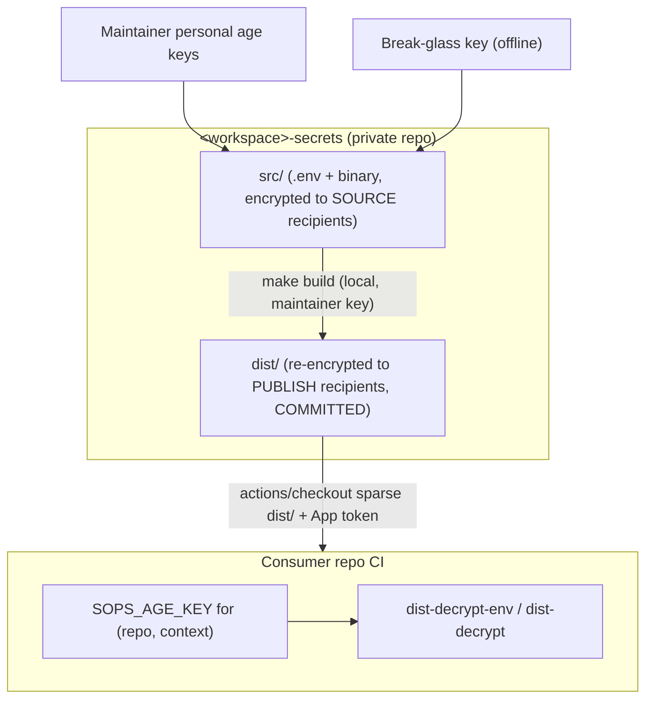

# Secrets Repository — Reference Architecture

> **Status:** candidate reference architecture / personal standard. Not a universal
> default — see [README.md](README.md) for when to adopt and known tradeoffs.
>
> Placeholders: `<workspace>` (e.g. `nowline`), `<org>` (e.g. `lolay`).

Candidate architecture for managing secrets across an estate through a single
private GitHub repo, using SOPS + age. Portable across projects: it needs nothing
but GitHub (no cloud KMS, no 1Password, no external secret store).

## Goals

- One source of truth for all secrets in an estate, version-controlled (as ciphertext).
- Coarse access control by **file** (topic), fine access control by **key**.
- Access granted by named **groups** of `repo__context` identities, mapped to
  files explicitly — no inherited or implied access. See
  [Groups and the access matrix](#groups-and-the-access-matrix).
- Per-consumer, per-context keys so a leak is contained.
- No always-on machine key that can read the editable source secrets.
- Cloud-agnostic: GitHub + age only.

## How it works in one picture



Two independent gates protect a consumer:

1. **Coarse / can you fetch the ciphertext at all** — a read-only **Secrets
   GitHub App** grants `contents: read` on the secrets repo so CI can check it
   out. This is per-repo.
2. **Fine / what can you actually decrypt** — the consumer's `SOPS_AGE_KEY`.
   A consumer may pull every file but only decrypts the ones encrypted to its
   key. All access control lives here.

The key never decrypts more than it is a recipient of, so the second gate is the
real access-control boundary; the App is just "are you allowed to see the
(encrypted) blobs."

---

## Consumer side (start here)

This is what every consuming repo wires up. Makefile target details and examples:
[makefile.md](makefile.md).

### Identity model: `(repo, context)`

Each consumer gets its own age keypair **per execution context**, because
GitHub keeps separate secret stores that can each hold a secret of the **same
name** with a **different value**:

- `actions` — normal CI
- `agents` — GitHub Agents / Copilot coding-agent runs (separate store from Actions)
- `codespaces`
- `dependabot`

The secret is **always named `SOPS_AGE_KEY`**; only the value differs per store.
This is how you give an agent *less* than actions: the `agents` key is a
recipient of fewer files than the `actions` key in the same repo.

> Provisioning note: `gh secret set SOPS_AGE_KEY --app actions|agents|codespaces|dependabot`
> covers the four native stores. `dependabot` cannot mint App tokens the normal
> way, so a Dependabot job that needs secrets must have them pre-staged rather
> than fetched live.

The identity is always `(repo, context)`. Provision the `actions` context for a
repo first; add `agents` / `codespaces` / `dependabot` for that repo when a
workflow in that context needs secrets. Each context key is one more recipient on
the files it can open.

### The consumer step

The consumer checks out `dist/` (HEAD is always the latest) and decrypts what its
key can open. Prefer the [least-privilege hierarchy](makefile.md#least-privilege-hierarchy).

**Checkout (all consumers):**

```yaml
- uses: actions/create-github-app-token@v1
  id: tok
  with:
    app-id: ${{ vars.SECRETS_APP_ID }}
    private-key: ${{ secrets.SECRETS_APP_PRIVATE_KEY }}
    owner: <org>
    repositories: <workspace>-secrets
    permission-contents: read

- uses: actions/checkout@v4
  with:
    repository: <org>/<workspace>-secrets
    token: ${{ steps.tok.outputs.token }}
    sparse-checkout: dist
    path: _secrets
    fetch-depth: 1

- uses: nhedger/setup-sops@v2   # installs the sops binary; age support is built in
```

**Decrypt (pick the narrowest target):**

```yaml
# 1. One key, one command (preferred when a single value suffices)
- name: Use required secret for one command only
  env:
    SOPS_AGE_KEY: ${{ secrets.SOPS_AGE_KEY }}
  run: PUBLIC_API_URL="$(make -C _secrets dist-decrypt-env KEY=PUBLIC_API_URL)" npm run build

# 2a. Export one key to the job environment for later steps
- name: Export one required secret for later steps
  env:
    SOPS_AGE_KEY: ${{ secrets.SOPS_AGE_KEY }}
  run: make -C _secrets dist-decrypt-env KEY=PUBLIC_API_URL FORMAT=dotenv >> "$GITHUB_ENV"

# 2b. Export all decryptable env secrets for later steps
- name: Export all decryptable env secrets for later steps
  env:
    SOPS_AGE_KEY: ${{ secrets.SOPS_AGE_KEY }}
  run: make -C _secrets dist-decrypt-env >> "$GITHUB_ENV"

# 3. Decrypt a binary/file secret to disk (signing material, certs)
- name: Decrypt signing file to disk
  env:
    SOPS_AGE_KEY: ${{ secrets.SOPS_AGE_KEY }}
  run: make -C _secrets dist-decrypt FILE=ios/AuthKey_BV7QPDLS45.p8
```

Notes:

- **One shipped entrypoint.** `dist-decrypt-env.sh` and `dist-decrypt.sh` live in
  the secrets repo and travel with the checkout, so decrypt logic is defined once.
- **Always latest, no versioning needed.** `actions/checkout` at HEAD of `main`
  gives the newest `dist/`. Pin `ref:` to a SHA or tag only for reproducible builds.
- **What the checkout pulls.** Cone-mode `sparse-checkout: dist` brings `dist/`
  plus root files (`Makefile`, `dist-decrypt-env.sh`, `dist-decrypt.sh`) — never
  `src/`, `scripts/`, or `keys/`.
- The same step works for Codespaces and GitHub Agents; only the *store* the
  `SOPS_AGE_KEY` is read from changes.
- **`dist-decrypt-env`** emits dotenv to stdout only — never writes env files to
  disk. **`dist-decrypt`** writes plaintext siblings to disk only — never emits
  environment assignments.
- Workflow jobs should decrypt only the file(s) or key(s) needed; separate
  sensitive topics into different env files and contexts where practical.

---

## The secrets repo

### Structure

```text
<workspace>-secrets/                       private repo
├─ .sops.yaml                              SOURCE recipients (maintainer + break-glass pubs) for src/ and keys/
├─ .gitignore                              track only *.sops under src/ dist/ keys/ (plaintext can't be committed)
├─ Makefile                                see makefile.md
├─ README.md                               short pointer to this spec
├─ access.map                              SOURCE OF TRUTH: groups + file -> groups/identities (logical names, no .sops)
├─ breakglass.pub                          break-glass PUBLIC key (a publish recipient on every file)
├─ dist-decrypt-env.sh                     CONSUMER entrypoint: dotenv to stdout
├─ dist-decrypt.sh                         CONSUMER entrypoint: files to disk
├─ src/                                    editable originals; only *.sops is tracked (plaintext sibling is gitignored)
│  ├─ oss.env.sops                         .env topics (dotenv)
│  ├─ commercial.env.sops
│  ├─ payments.env.sops
│  └─ ios/                                 binary blobs (certs, keys); any folder depth is allowed
│     ├─ AuthKey_BV7QPDLS45.p8.sops
│     └─ distribution.p12.sops
├─ dist/                                   COMMITTED, re-encrypted per-file to PUBLISH recipients (mirrors src/)
│  ├─ oss.env.sops
│  ├─ commercial.env.sops
│  ├─ payments.env.sops
│  └─ ios/
│     ├─ AuthKey_BV7QPDLS45.p8.sops
│     └─ distribution.p12.sops
├─ keys/
│  └─ repos.env.sops                       SOPS-enc to maintainers + break-glass:
│                                          <repo>__<context>__public / __private for every consumer
├─ scripts/
│  ├─ build.sh                             resolve publish recipients (transient) + re-encrypt src/ -> dist/
│  ├─ crypt.sh                             src <-> .sops sibling (safe + idempotent)
│  ├─ set-consumer-keys.sh                 fan SOPS_AGE_KEY out to all (or one) repo__context
│  ├─ mint-consumer.sh                     generate a NEW keypair (refuses to overwrite an existing one)
│  ├─ rotate-consumer.sh                   replace an EXISTING keypair
│  └─ verify.sh
└─ .githooks/
   └─ pre-commit                           keyless: refuse non-.sops + assert src/<f>.sops paired with dist/<f>.sops
```

**The `.sops` convention.** Every encrypted file on disk carries a trailing
`.sops` suffix (`oss.env.sops`, `ios/AuthKey_BV7QPDLS45.p8.sops`). A decrypted
file is the same name **without** the suffix, written right next to its
ciphertext (`oss.env` beside `oss.env.sops`). `.gitignore` tracks only `*.sops`
under `src/`, `dist/`, and `keys/`, so a decrypted plaintext sibling literally
cannot be committed — the suffix is the safety boundary, not just a hook. The
`access.map` and the matrix below use the **logical** name (no `.sops`); the
scripts add/strip the suffix.

The tracked files are exactly `.sops.yaml`, `.gitignore`, `access.map`,
`breakglass.pub`, `dist-decrypt-env.sh`, `dist-decrypt.sh`, and the `*.sops`
files under `src/`, `dist/`, and `keys/`. **Publish recipient lists are never
committed** — `build` computes them transiently from `access.map` +
`keys/repos.env.sops` at encrypt time. There is intentionally **no
`.github/workflows/` that holds a key**; an optional *keyless* freshness-check
workflow is described later.

```gitignore
# .gitignore — only *.sops is tracked under src/ dist/ keys/; plaintext siblings are ignored
/src/**
/dist/**
/keys/**
!/src/**/
!/dist/**/
!/keys/**/
!/src/**/*.sops
!/dist/**/*.sops
!/keys/**/*.sops
```

### Groups and the access matrix

Files are the coarse access unit. Name them by topic, and grant access with named
**groups** of `repo__context` identities. A group is just a label for a set of
identities — there is **no inheritance or implied access**. Every file lists
exactly the groups (or individual `repo__context` keys) allowed to decrypt it.

Worked example estate (cells are `repo__context`; the `actions` context is shown —
a repo may also have `agents`, `codespaces`, etc.):

| file \ identity (group)  | nowline (oss) | nowline-site (oss) | nowline-app (commercial) | nowline-infra (commercial) | nowline-api (payments) |
|--------------------------|:---:|:---:|:---:|:---:|:---:|
| `oss.env`                | yes | yes | yes | yes | yes |
| `commercial.env`         |     |     | yes | yes | yes |
| `payments.env`           |     |     |     |     | yes |
| `ios/AuthKey_*.p8`       |     |     | yes |     |     |
| `ios/distribution.p12`   |     |     | yes |     |     |

Each row is exactly the access list for that file — nothing is inferred:

- `oss.env` lists `@oss`, `@commercial`, and `@payments`, so every identity reads
  it (you list those groups; it is not automatic).
- `commercial.env` lists `@commercial` and `@payments`, not `@oss`.
- `payments.env` lists only `@payments` — a single repo here (`nowline-api`).
- The iOS signing assets list only `nowline-app__actions` — narrower than any
  group. Note `@payments`, despite being the most sensitive group, has **no**
  access to them: because groups do not inherit, "most sensitive" never implies
  "reads everything."

> Multi-project repos: if one `<workspace>-secrets` repo serves several projects,
> prefix files with the project — `web-oss.env`, `mobile-commercial.env` — so the
> topic stays the access unit while names stay unambiguous.

### Two keyrings

- **SOURCE recipients** = maintainer personal keys + break-glass. This list **is
  committed** — it lives in `.sops.yaml`. Only these keys can read `src/` (and
  `keys/repos.env.sops`). Re-encryption to `dist/` happens **locally** with a
  maintainer key, so no machine key ever reads source.
- **PUBLISH recipients** (per file) = the consumer `(repo, context)` keys allowed
  to decrypt that file, plus break-glass. `build` resolves them from `access.map`
  + `keys/repos.env.sops` at encrypt time; the lists are transient and never
  committed. They cannot open `src/`.

```yaml
# .sops.yaml — committed SOURCE recipients (maintainers + break-glass)
creation_rules:
  - path_regex: ^(src|keys)/.*
    age: >-
      age1alice...,
      age1bob...,
      age1breakglass...      # same key as breakglass.pub
```

Adding/removing a maintainer: edit the `age:` list in `.sops.yaml`, then
`sops updatekeys src/**/*.sops keys/repos.env.sops` to re-encrypt source to the
new set.

### `access.map` — the source of truth

Define groups as sets of `repo__context` identities at the top, then list which
groups (or individual `repo__context` keys) may decrypt each file. There is no
inheritance — list every group that should have access.

```text
# --- groups: named sets of repo__context identities ---
@oss        = nowline__actions nowline-site__actions
@commercial = nowline-app__actions nowline-infra__actions
@payments   = nowline-api__actions

# --- file : groups / identities allowed to DECRYPT it (no inheritance) ---
oss.env:                    @oss @commercial @payments
commercial.env:             @commercial @payments
payments.env:               @payments

ios/AuthKey_BV7QPDLS45.p8:  nowline-app__actions
ios/distribution.p12:       nowline-app__actions
```

At build time `build.sh` expands each `@group`, resolves public keys from
`keys/repos.env.sops`, adds break-glass, and re-encrypts `src/<file>.sops` to
`dist/<file>.sops`.

### `keys/repos.env.sops` — the consumer key registry

One SOPS-encrypted dotenv (recipients: maintainers + break-glass) holding every
consumer keypair:

```dotenv
nowline-app__actions__public=age1...
nowline-app__actions__private=AGE-SECRET-KEY-1...
nowline-app__agents__public=age1...
nowline-app__agents__private=AGE-SECRET-KEY-1...
nowline-api__actions__public=age1...
nowline-api__actions__private=AGE-SECRET-KEY-1...
```

> Delimiter: use `__` — `<repo>__<context>__public` / `__private` — so repo
> names with dashes parse unambiguously.

This file is decrypted **only** by maintainer-local targets (`make build`,
`make set-keys`). **Custody caveat:** it holds every consumer *private* key in one
place. A maintainer source-key compromise exposes all consumer contexts — plan
break-glass and maintainer access accordingly.

### Non-`.env` secrets (binary: `.p8`, `.p12`, certs, mobileprovision)

Binary blobs use SOPS **binary** type — same repo, recipients, and access matrix:

```bash
cp /path/to/AuthKey_BV7QPDLS45.p8 src/ios/AuthKey_BV7QPDLS45.p8
make src-encrypt FILE=ios/AuthKey_BV7QPDLS45.p8
make build
```

On the consumer, `make dist-decrypt FILE=ios/AuthKey_BV7QPDLS45.p8` writes the
plaintext next to its `.sops` file (`_secrets/dist/ios/AuthKey_BV7QPDLS45.p8`).

```yaml
- name: Use iOS signing secrets
  env:
    SOPS_AGE_KEY: ${{ secrets.SOPS_AGE_KEY }}
  run: |
    set -euo pipefail
    make -C _secrets dist-decrypt FILE=ios/AuthKey_BV7QPDLS45.p8
    make -C _secrets dist-decrypt FILE=ios/distribution.p12
    mkdir -p ~/private_keys
    cp _secrets/dist/ios/AuthKey_BV7QPDLS45.p8 ~/private_keys/
    security import _secrets/dist/ios/distribution.p12 -k <keychain> ...
```

> Size note: SOPS binary base64-inflates ~33%; fine for keys/certs (KB range).
> Scope signing material to one repo.

---

## Makefile

Full target contract, arguments, and GitHub Actions examples: [makefile.md](makefile.md).

**What runs where:** targets that read source secrets (`src-decrypt`, `src-encrypt`,
`build`, `set-keys`, `mint`, `rotate`) are maintainer-local and need a source key.
`dist-decrypt-env` and `dist-decrypt` run on consumers and need only that
consumer's `SOPS_AGE_KEY`. Nothing requires a source key in CI.

---

## Reference scripts

### `scripts/build.sh`

```bash
set -euo pipefail
reg=$(sops -d --input-type dotenv keys/repos.env.sops)   # maintainer key required
bg=$(cat breakglass.pub)

declare -A GROUP
while IFS= read -r line; do
  case "$line" in @*) name=${line%%=*}; GROUP[${name// /}]=${line#*=} ;; esac
done < access.map

while IFS=: read -r file rest; do
  [ -z "${file:-}" ] && continue
  case "$file" in \#*|@*) continue ;; esac
  rcpts="$bg"
  for tok in $rest; do
    case "$tok" in @*) items=${GROUP[$tok]} ;; *) items=$tok ;; esac
    for id in $items; do
      pub=$(printf '%s\n' "$reg" | sed -n "s/^${id}__public=//p")
      rcpts="$rcpts,$pub"
    done
  done
  case "$file" in *.env) t=dotenv ;; *) t=binary ;; esac
  mkdir -p "dist/$(dirname "$file")"
  sops -d --input-type "$t" --output-type "$t" "src/$file.sops" \
    | SOPS_AGE_RECIPIENTS="$rcpts" sops -e --input-type "$t" --output-type "$t" /dev/stdin \
    > "dist/$file.sops"
done < access.map
```

### `dist-decrypt-env.sh` — dotenv to stdout

```bash
# dist-decrypt-env.sh — CONSUMER: dotenv secrets to stdout (never to disk)
# usage: FILE=... KEY=... FORMAT=... dist-decrypt-env.sh <root>
#   FORMAT=dotenv  -> KEY=VALUE lines (default when KEY unset; also when KEY set with FORMAT=dotenv)
#   FORMAT unset + KEY set -> raw value only
# env: SOPS_AGE_KEY (required), FILE / KEY / FORMAT (optional)
set -euo pipefail
root=${1:-dist}
sel_file=${FILE:-}
want_key=${KEY:-}
format=${FORMAT:-}

emit_file() {
  local f=$1 logical=${f%.sops}; logical=${logical#"$root"/}
  sops -d --input-type dotenv --output-type dotenv "$f" 2>/dev/null \
    || { echo "# skip $logical (key cannot decrypt — expected)" >&2; return 1; }
}

if [ -n "$want_key" ]; then
  matches=()
  if [ -n "$sel_file" ]; then
    f="$root/$sel_file.sops"
    [ -f "$f" ] || { echo "missing $f" >&2; exit 1; }
    content=$(emit_file "$f") || exit 1
    line=$(printf '%s\n' "$content" | sed -n "s/^\(${want_key}\)=//p" | head -1)
    [ -n "$line" ] || { echo "KEY $want_key not in $sel_file" >&2; exit 1; }
    if [ "$format" = dotenv ]; then echo "${want_key}=${line}"; else printf '%s' "$line"; fi
    exit 0
  fi
  while read -r f; do
    content=$(emit_file "$f" 2>/dev/null) || continue
    line=$(printf '%s\n' "$content" | sed -n "s/^\(${want_key}\)=//p" | head -1)
    [ -n "$line" ] && matches+=("${f%.sops}")
  done < <(find "$root" -type f -name '*.env.sops')
  [ ${#matches[@]} -gt 0 ] || { echo "KEY $want_key not found in any decryptable env file" >&2; exit 1; }
  if [ ${#matches[@]} -gt 1 ]; then
    echo "KEY $want_key appears in multiple files: ${matches[*]#"$root"/}" >&2
    echo "Pass FILE=<logical-name> to disambiguate." >&2
    exit 1
  fi
  f="${matches[0]}.sops"
  content=$(emit_file "$f")
  line=$(printf '%s\n' "$content" | sed -n "s/^\(${want_key}\)=//p" | head -1)
  if [ "$format" = dotenv ]; then echo "${want_key}=${line}"; else printf '%s' "$line"; fi
  exit 0
fi

if [ -n "$sel_file" ]; then
  [ -f "$root/$sel_file.sops" ] || { echo "missing $root/$sel_file.sops" >&2; exit 1; }
  emit_file "$root/$sel_file.sops" || exit 1
  exit 0
fi

find "$root" -type f -name '*.env.sops' | while read -r f; do
  emit_file "$f" || true
done
```

### `dist-decrypt.sh` — files to disk

```bash
# dist-decrypt.sh — CONSUMER: decrypt SOPS files to plaintext siblings on disk
# usage: FILE=... dist-decrypt.sh <root>
# env: SOPS_AGE_KEY (required), FILE (optional). Does NOT emit environment assignments.
set -euo pipefail
root=${1:-dist}
sel=${FILE:-}

decrypt_one() {
  local f=$1 required=${2:-0} out=${f%.sops} rel=${out#"$root"/}
  [ -f "$f" ] || { echo "missing $f" >&2; [ "$required" = 1 ] && return 1 || return 0; }
  case "$out" in
    *.env)
      sops -d --input-type dotenv --output-type dotenv "$f" > "$out" 2>/dev/null \
        || { rm -f "$out"; echo "# skip $rel (key cannot decrypt — expected)" >&2; [ "$required" = 1 ] && return 1 || return 0; } ;;
    *)
      sops -d --input-type binary --output-type binary "$f" > "$out" 2>/dev/null \
        || { rm -f "$out"; echo "# skip $rel (key cannot decrypt — expected)" >&2; [ "$required" = 1 ] && return 1 || return 0; } ;;
  esac
}

if [ -n "$sel" ]; then
  decrypt_one "$root/$sel.sops" 1
  exit 0
fi

find "$root" -type f -name '*.sops' | while read -r f; do
  decrypt_one "$f"
done
```

### `scripts/crypt.sh`

```bash
# usage: crypt.sh <decrypt|encrypt> [logical-path-under-src]
set -euo pipefail
op=$1; sel=${2:-}
ftype() { case "$1" in *.env) echo dotenv ;; *) echo binary ;; esac; }
case "$op" in
  decrypt)
    list=$([ -n "$sel" ] && echo "src/$sel.sops" || find src -type f -name '*.sops')
    for c in $list; do
      p=${c%.sops}
      [ -e "$p" ] && { echo "skip $p (plaintext exists — edit it, or 'make clean')"; continue; }
      t=$(ftype "$p"); sops -d --input-type "$t" --output-type "$t" "$c" > "$p"
    done ;;
  encrypt)
    list=$([ -n "$sel" ] && echo "src/$sel" || find src -type f ! -name '*.sops')
    for p in $list; do
      t=$(ftype "$p"); sops -e --input-type "$t" --output-type "$t" "$p" > "$p.sops" && rm -f "$p"
    done ;;
esac
```

### `scripts/set-consumer-keys.sh`

```bash
# usage: set-consumer-keys.sh [repo] [context]
set -euo pipefail
want_repo=${1:-}; want_ctx=${2:-}
sops -d --input-type dotenv keys/repos.env.sops | while IFS='=' read -r k v; do
  case "$k" in *__private) ;; *) continue ;; esac
  base=${k%__private}; repo=${base%__*}; ctx=${base##*__}
  [ -n "$want_repo" ] && [ "$repo" != "$want_repo" ] && continue
  [ -n "$want_ctx"  ] && [ "$ctx"  != "$want_ctx"  ] && continue
  case "$ctx" in
    actions|agents|codespaces|dependabot)
      gh secret set SOPS_AGE_KEY -R "<org>/$repo" --app "$ctx" -b "$v" ;;
    *)
      echo "unknown context $ctx — add native store mapping or set manually" >&2
      exit 1 ;;
  esac
  echo "set SOPS_AGE_KEY  $repo  ($ctx)"
done
```

> The four native stores (`actions`, `agents`, `codespaces`, `dependabot`) each
> hold a separate `SOPS_AGE_KEY`. The `agents` store is for GitHub Agents /
> Copilot and is provisioned with `gh secret set --app agents`.

---

## Build & freshness

`dist/` is committed, so it must stay in sync with `src/`. Two keyless guards:

1. **Local pre-commit hook** — refuse non-`.sops` under `src/`, `dist/`, `keys/`;
   require every changed `src/<file>.sops` to ship with matching `dist/<file>.sops`.

2. **Optional keyless CI check** — fail if `src/*.sops` changed without matching
   `dist/*.sops` in the same push.

---

## Setup runbook (one-time)

1. Create private repo `<org>/<workspace>-secrets`. Protect `main`; CODEOWNERS on
   `src/`, `access.map`, `keys/`, `.githooks/`.
2. Generate break-glass key offline; put public key in `breakglass.pub` and
   `.sops.yaml`.
3. Add maintainer public keys to `.sops.yaml`.
4. Register read-only Secrets GitHub App (`contents: read`); install on secrets
   repo and consumers. Distribute `SECRETS_APP_ID` + `SECRETS_APP_PRIVATE_KEY`.
5. `make init` locally.
6. `make mint REPO=<repo> CONTEXT=actions` (and `agents` etc. as needed); edit
   `access.map`.
7. Drop plaintext into `src/`, `make src-encrypt`, `make build`, commit `*.sops`.
8. `make set-keys` to push `SOPS_AGE_KEY` to each store.
9. Wire consumers with the [consumer step](#the-consumer-step).

---

## Rotation & offboarding

- **Add consumer key:** `make mint REPO=.. CONTEXT=..` (refuses if exists).
- **Rotate consumer key:** `make rotate` → `set-keys` → `build` → commit. Stops
  *future* decryption with the old key; does not erase git history.
- **Remove consumer:** delete from `access.map` and `repos.env.sops`, `make build`,
  delete repo's `SOPS_AGE_KEY`.
- **Rotate maintainer:** update `.sops.yaml`, `sops updatekeys`.
- **Leaked secret value:** revoke at the upstream provider; treat all committed
  ciphertext versions as compromised — not fixable by `git revert` alone.

---

## Threat model

- **`src/` (editable secrets)** — readable only by maintainers + break-glass. No
  CI key can read them; re-encryption is local.
- **`dist/` (published)** — readable by each file's mapped consumer keys +
  break-glass. The App token only downloads ciphertext.
- **`keys/repos.env.sops`** — holds all consumer private keys, encrypted to
  maintainer source keys. Maintainer key compromise exposes every consumer context.
- **Consumer key leak** — attacker decrypts only files that key is a recipient of,
  including that file's git history. `make rotate` stops future access with the
  leaked key; rotate upstream secret values if the private key may have leaked.
- **Secrets App key leak** — attacker downloads ciphertext they cannot decrypt.
- **Break-glass key** — opens everything; offline only.
- **Sensitivity tiers** — enforced by recipients, not inheritance. An OSS-context
  key is not a recipient of `commercial.env` even if it can download the blob.
